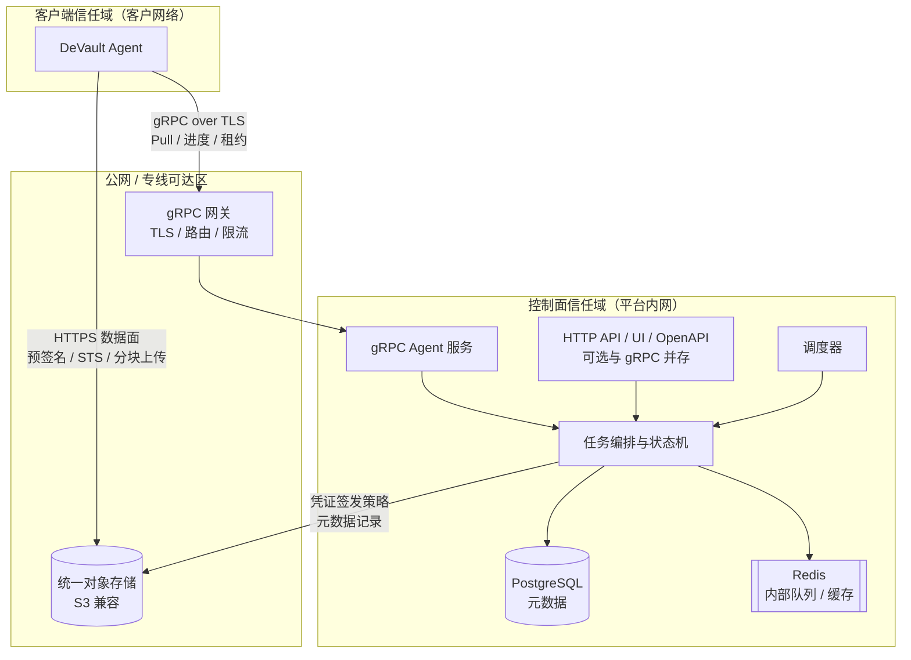
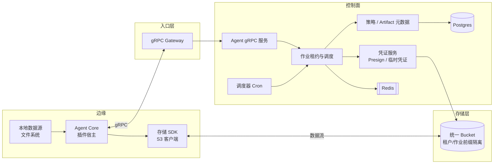
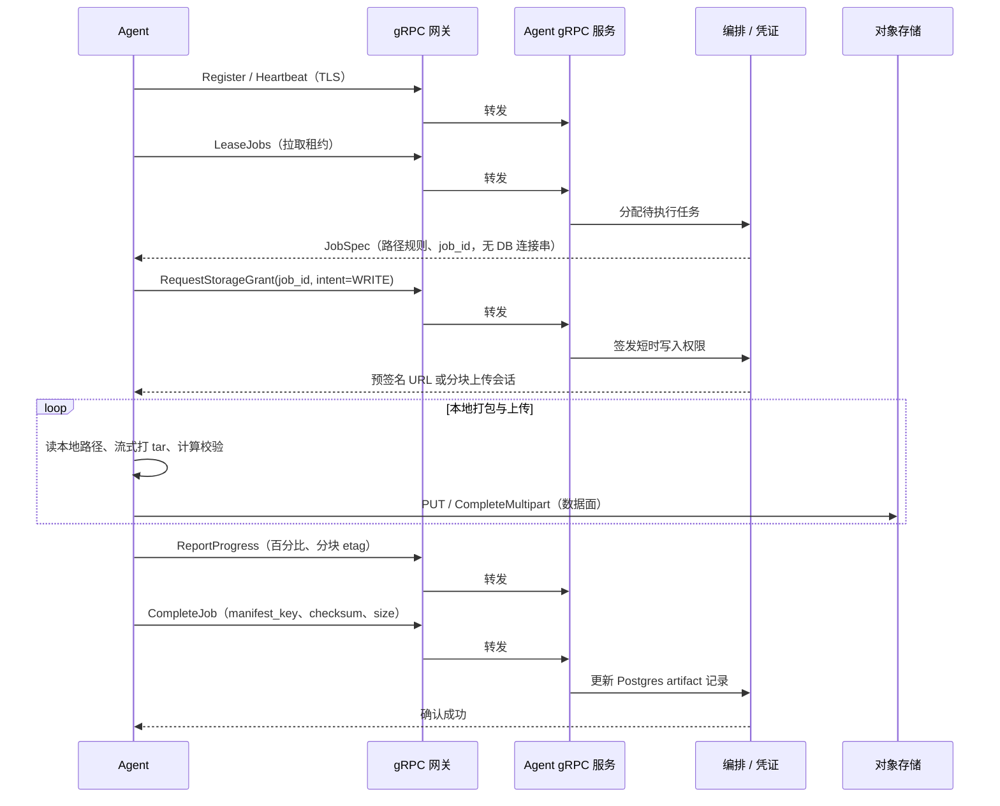

# DeVault 目标架构方案（边缘 Agent + 控制面）

> **文档角色**：在既有 [`development-design.md`](./development-design.md) 与实现之上，描述**下一阶段的体系结构目标**，用于对齐边界、安全模型与演进路线。  
> **已定决策**：**Pull 任务拉取**、**gRPC 经网关暴露**、**统一对象存储**（平台托管 S3 兼容存储，非客户自带 Bucket）。

---

## 1. 背景与问题陈述

当前实现采用 **Celery Worker** 与 **PostgreSQL / Redis** 同栈部署：执行单元若下沉到客户网络，则需访问控制面中间件，扩张攻击面且不符合「客户端仅暴露控制信号与数据通道」的预期。

本方案定义**目标态**：边缘仅部署 **Agent**；控制面中间件（Postgres、Redis、内部队列等）**不出现在客户端信任域**；**控制信令**走 **gRPC（经网关）**；**备份字节流**仅经 **统一对象存储**。

---

## 2. 目标原则

| 原则 | 说明 |
|------|------|
| **边缘不连中间件** | Agent 不配置、不连接 Postgres、Redis；仅连接 **gRPC 端点**（经网关）与 **对象存储 API**。 |
| **控制与数据分离** | gRPC 只承载作业描述、租约、进度、存储凭证元数据；**大对象不经过 gRPC**。 |
| **Pull** | Agent **主动**拉取任务租约并上报状态；控制面**不主动入连**客户内网（适配防火墙出站策略）。 |
| **经网关** | 对外统一入口：TLS、路由、限流、观测；后端 gRPC 服务可多实例水平扩展。 |
| **统一存储** | Artifact 落 **平台托管**的 S3 兼容桶（单一或多桶逻辑分区）；首版不强制 BYOB（客户自带 Bucket 可作为后续扩展）。 |

---

## 3. 总体架构图（信任域）

下图表示网络与信任边界：**客户端域**仅出站访问 **API 网关**与 **对象存储**；**控制面域**包含编排、元数据库与内部消息基础设施。

**读图要点**：

- **实线「Agent → 网关」**：唯一的控制面交互通道（Pull）。  
- **实线「Agent → 对象存储」**：备份/恢复**字节流**；凭证由控制面经 gRPC **下发或间接生成**，Agent 不持有平台长期根密钥。  
- **「ORCH → OBJ」**：控制面侧校验清单、记录 key、生命周期策略；不替代 Agent 的大流量路径。

---

## 4. 逻辑组件图

下图按**职责**分解模块，不绑定具体进程拆分（可合并或拆微服务）。

| 组件 | 职责 |
|------|------|
| **Agent Core** | 维护与网关的 gRPC 连接；执行 Pull；驱动文件（及后续 DB）插件；向存储 SDK 提供待上传/下载句柄。 |
| **存储 SDK** | 分块上传、断点续传、校验；仅访问**本次作业授权**的前缀或预签名 URL。 |
| **gRPC Gateway** | 对外监听；TLS 终结；可选认证（mTLS 或 Token）；反向代理到 **Agent gRPC 服务**。 |
| **Agent gRPC 服务** | 实现租约发放、心跳、进度上报、完成/失败回调等业务 RPC。 |
| **作业租约与调度** | 与 Redis/Celery 等内部实现解耦；对边缘只暴露「可领取的作业」抽象。 |
| **凭证服务** | 为单次作业生成短时 **读写** 存储权限（预签名 URL、或 IAM 临时凭证视部署而定）。 |
| **统一 Bucket** | 逻辑上可按 `env/tenant/job_id/` 分层；加密与保留策略由平台策略引擎配置。 |

---

## 5. 控制面 vs 数据面

| 平面 | 路径 | 内容 |
|------|------|------|
| **控制面** | Agent → 网关 → Agent gRPC 服务 | 注册/心跳、**LeaseJobs**、进度与日志摘要、**CompleteJob**、失败原因、存储授权请求（返回预签名 URL 集合或会话 token）。 |
| **数据面** | Agent → 对象存储 | Artifact 分块、manifest、校验大数据；**不经 gRPC 传文件本体**。 |

---

## 6. Pull 模式交互序列（备份成功路径）

恢复路径对称：**RequestStorageGrant(intent=READ)** → Agent 从 ST 拉取 bundle → 本地展开 → **CompleteJob**。

---

## 7. 网关层说明（实现选项）

网关不改变 **Pull** 语义，只改变**入口形态**：

- **职责**：TLS 终结、SNI/路由、gRPC 反射与健康检查（可按环境关闭）、连接限流、可选 JWT/mTLS 校验、审计日志。  
- **常见实现**：Envoy、nginx（gRPC）、云厂商 ALB/NLB + 后端、Traefik 等。  
- **后端**：一至多个 **Agent gRPC Service** 实例，由网关做负载均衡。

---

## 8. 统一存储说明

**含义**：所有 Artifact 落在**平台运维**的 S3 兼容集群（如 MinIO 集群、云厂商单个账号下的 Bucket），通过 **前缀或 Bucket 策略**隔离租户与作业。

| 项 | 说明 |
|----|------|
| **Agent 侧** | 仅持有**短时**上传/下载凭证；不嵌入平台永久 Access Key。 |
| **控制面侧** | 持久化 `bundle_key`、`manifest_key`、checksum、大小等；生命周期与合规扫描针对统一命名空间。 |
| **后续扩展（非本方案首版）** | **BYOB**：为客户 OSS/S3 签发跨账号凭证，仍保持「数据面仅存储」原则，仅凭证来源与 bucket 名变为租户级配置。 |

---

## 9. 安全摘要

- **网络**：客户侧通常仅开放 **出站 HTTPS** 至网关与存储端点。  
- **身份**：推荐 **mTLS**（客户端证书标识站点）或 **短期访问令牌**（由 Register 交换）。  
- **权限**：存储凭证 **按 job、按前缀** 限时、限操作（Put/Get/List 最小集）。  
- **审计**：作业创建、租约、完成均在 Postgres 留痕；网关访问日志辅助溯源。

---

## 10. 与当前代码形态的关系

| 当前（Compose 示意） | 目标 |
|----------------------|------|
| Celery Worker 连接 Postgres + Redis | 边缘 **Agent** 不连；控制面内部_worker 或编排器仍可连 Redis 消费内部队列 |
| Worker 容器挂载数据源 | **Agent** 在客户机挂载数据源；控制面无挂载 |
| HTTP API 创建任务 | 可保留 HTTP 供人机与集成；**边缘仅 gRPC + 存储** |

演进建议：**并行定义 `.proto` 与最小 Agent** → 将文件备份执行路径从「同栈 Worker」迁到「租约 + Agent」→ 逐步下线「边缘直连中间件」的部署方式。

---

## 11. 文档修订记录

| 日期 | 变更 |
|------|------|
| 2026-05-08 | 初稿：Pull + 网关 + 统一存储；含架构图与逻辑组件图及备份序列图 |
