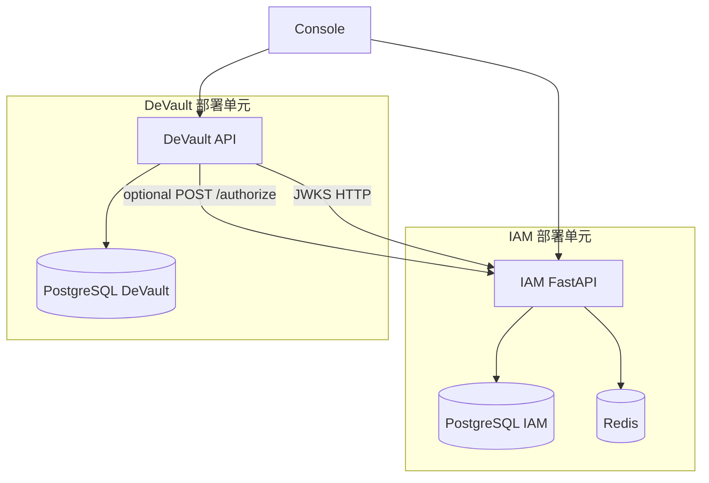

# DeVault IAM 服务设计方案

本文档描述 **独立部署的 IAM 服务** 的目标架构、职责边界、数据模型、API 与 JWT 约定，以及与 **DeVault 控制面** 的集成与迁移思路。实现代码位于仓库根目录 **`iam/`** 文件夹（独立 `pyproject.toml`、独立镜像构建），与 `src/devault` 无源码耦合。

愿景级原则见 [`docs-old/iam.md`](../docs-old/iam.md)；本文档在其实践上收敛为：**仅管理「人」与「控制面 API Key」**，**不包含** Agent、gRPC  enrollment、数据面凭证。

---

## 1. 设计目标与非目标

### 1.1 目标

- **独立进程**：IAM 仅暴露 HTTP API（及 JWKS 等元数据端点）。
- **独立数据**：专用 PostgreSQL 数据库（或同实例独立 `database`），与 DeVault 的 `devault` 库分离。
- **独立配置**：数据库 URL、Redis、JWT 签名密钥等与 DeVault 分离。
- **职责**：
  - **Identity**：注册、登录、刷新/吊销会话、密码、MFA。
  - **Tenant 与成员**：租户、`tenant_members`、邀请（按产品需要迭代）。
  - **RBAC**：`roles`、`permissions`、`role_permissions`；成员绑定 `role_id`。
  - **控制面 API Key**：创建/吊销、哈希存储、细粒度 **`api_key_scopes`（permission key）**。
  - **Authorize**：`POST /authorize`（供 DeVault 或网关在需要时调用）。
  - **身份域审计**：登录、密钥、成员变更等（业务资源级审计仍在 DeVault）。

### 1.2 非目标

- **Agent、`AgentEnrollment`、gRPC Agent session** 等：保留在 DeVault。
- **备份领域对象**（Job、Policy、Artifact…）及 **资源是否属于某租户** 的判断：DeVault 职责。
- **恢复/备份等业务审计正文**：不进入 IAM 领域模型（与 `docs-old/iam.md` 第十八章一致）。

---

## 2. 仓库与目录约定

| 路径 | 说明 |
|------|------|
| **`iam/`** | IAM 服务根目录：自有 `pyproject.toml`、`src/devault_iam/`、`alembic/`、`Dockerfile` |
| **`docs/iam-service-design.md`** | 本设计文档 |
| **`src/devault/`** | 现有控制面；迁移完成后人类身份与 `ControlPlaneApiKey` 等从本包移除，改为校验 IAM 签发的 JWT |

`iam` 包名 **`devault_iam`** 避免与 `devault` 安装命名空间冲突。

---

## 3. 技术栈（与 DeVault 控制面对齐）

- Python **3.12+**
- **FastAPI**、**Uvicorn**
- **SQLAlchemy 2**、**Alembic**、**PostgreSQL**（`psycopg`）
- **Redis**（限流、登录防护、权限缓存、可选 token 黑名单）
- **Pydantic v2**、**pydantic-settings**
- **PyJWT**、**cryptography**（推荐 **RS256/ES256** + JWKS）
- **argon2-cffi**、**pyotp**（密码与 MFA）
- **httpx**（对外 IdP / Webhook 等扩展）

IAM **不依赖** gRPC、boto3、APScheduler 等 DeVault 数据面/调度依赖（除非后续增加与对象存储无关的 Outbound 集成）。

---

## 4. 运行时架构



- **Console**：认证与租户管理相关请求指向 **IAM 基址**；业务请求指向 **DeVault**，请求头携带 `Authorization: Bearer <access_token>`，租户上下文可用 **`X-DeVault-Tenant-Id`**（或迁移期双读 **`X-Tenant-Id`**）。
- **DeVault**：迁移完成后 **不再** 读取 `console_users`、`tenant_memberships`、`control_plane_api_keys` 等表解析主体；仅从 **JWT**（+ 可选 Authorize）构造内部 `AuthContext` 等价结构。  
- **Agent / gRPC**：路径不变，仍使用 DeVault 现有 enrollment 与会话逻辑。

---

## 5. 数据模型（IAM 库）

### 5.1 Identity

- **`users`**：`id`, `email`, `password_hash`, `name`, `status`, `mfa_enabled`, `totp_secret`（建议应用层加密或 KMS 外置）, `totp_confirmed_at`, `created_at`, `updated_at`。
- **`sessions`**（若采用 refresh token）：`id`, `user_id`, `refresh_token_hash`, `ip`, `user_agent`, `expires_at`, `created_at`；可与 Redis 配合实现吊销与旋转。

### 5.2 Tenant

- **`tenants`**：`id`, `name`, `slug`, `plan`, `status`, `owner_user_id`, `created_at`。
- **`tenant_members`**：建议使用代理主键 `id`；`tenant_id`, `user_id`, `role_id`, `status`, `created_at`。

### 5.3 RBAC

- **`roles`**：`id`, `tenant_id`（**nullable**：`null` 表示平台级角色）, `name`, `is_system`。
- **`permissions`**：`id`, `key`（唯一）, `description`。
- **`role_permissions`**：`role_id`, `permission_id`。

种子数据：系统预置角色（如 `tenant_admin` / `operator` / `auditor`）及默认 `role_permissions`。

### 5.4 控制面 API Key

- **`api_keys`**：`id`, `tenant_id`（nullable 表示平台级 key）, `name`, `key_prefix`, `key_hash`, `created_by_user_id`, `expires_at`, `enabled`, `created_at`。
- **`api_key_scopes`**：`api_key_id`, `permission_key`（与 `permissions.key` 对齐并校验）。

**推荐用法**：创建 key 时返回 **一次性明文**；客户端用 **`grant_type=api_key`** 向 IAM 换取 **短期 Access JWT**，DeVault **只验 JWT**，避免每条请求命中 IAM 数据库（与 `docs-old/iam.md` 中权限缓存思路一致）。

### 5.5 身份域审计

- **`audit_logs`**：`id`, `tenant_id`, `actor_type`, `actor_id`, `action`, `resource_type`, `resource_id`, `metadata` JSONB, `created_at`。

---

## 6. 权限命名与 Authorize

IAM **只识别 permission `key` 字符串**，不解析 DeVault 内部资源类型。

建议前缀避免与其他产品冲突，例如：

- `devault.console.*`
- `devault.control.*`

**`POST /v1/authorize`**（对齐 `docs-old/iam.md` 第十一节）请求体示例：

```json
{
  "subject": { "type": "user", "id": "<uuid>" },
  "tenant_id": "<uuid>",
  "action": "devault.control.job.create",
  "resource": { "type": "job", "id": "<uuid>" }
}
```

`resource` 可预留；IAM 早期可忽略 resource，仅做 subject + tenant + action。  
**Redis 缓存**：`perm:{tenant_id}:{user_id}` → 权限列表；成员或角色变更时 **失效**。

---

## 7. HTTP API 清单（建议）

| 分组 | 方法 | 路径 | 说明 |
|------|------|------|------|
| Auth | POST | `/v1/auth/register` | 可选：自助注册 |
| | POST | `/v1/auth/login` | 邮箱密码 → access + refresh |
| | POST | `/v1/auth/refresh` | 刷新 access |
| | POST | `/v1/auth/logout` | 吊销 refresh |
| | POST | `/v1/auth/token` | `grant_type=api_key` 换 JWT |
| | … | `/v1/auth/mfa/*` | MFA 注册/校验 |
| Tenants | GET/POST | `/v1/tenants` | 创建/列举（按平台策略约束） |
| | GET/PATCH | `/v1/tenants/{id}` | |
| Members | CRUD | `/v1/tenants/{id}/members` | |
| API Keys | POST | `/v1/tenants/{id}/api-keys` | 租户范围控制面 key |
| | POST | `/v1/platform/api-keys` | 可选：平台级 key |
| | DELETE | `/v1/api-keys/{id}` | |
| Authorize | POST | `/v1/authorize` | 统一授权判定 |
| JWKS | GET | `/.well-known/jwks.json` 或 `/v1/jwks` | 公钥发布 |

除 login/register/jwks 等公开端点外，需 **`Authorization: Bearer`**。

---

## 8. JWT 约定（DeVault 信任边界）

### 8.1 算法

推荐 **非对称算法**（RS256 或 ES256），IAM 持有私钥；**JWKS** 发布公钥，支持 `kid` 轮换。

### 8.2 Claims（建议）

| Claim | 含义 |
|--------|------|
| `sub` | 用户 UUID，或 `api_key:{uuid}` |
| `iss` | IAM issuer URL |
| `aud` | 固定为 `devault-api`（DeVault 拒绝错误 audience） |
| `tid` | 当前工作租户 UUID（人类用户） |
| `tids` | 可访问租户列表（可选，注意体积） |
| `perm` | 展开后的 permission 字符串数组 |
| `pk` | `tenant_user` \| `platform` \| `api_key` |
| `mfa` | 是否已完成 MFA（敏感写操作可由 DeVault 二次检查） |

### 8.3 DeVault 校验

配置项建议：`IAM_ISSUER`、`IAM_JWKS_URL`、`IAM_AUDIENCE`。  
使用 **PyJWKClient** 拉取 JWKS，校验 `iss`、`aud`、`exp`，构造路由层使用的 principal 对象。

---

## 9. 租户与 DeVault 数据边界

**推荐策略（租户镜像）**：IAM 为租户与成员的 **权威源**；DeVault 保留 **`tenants` 表**（及资源上的 `tenant_id` FK），在 IAM 创建/更新租户成功后 **同步写入或事件消费** 镜像行，以便 Job/Policy 等外键不变。  
创建租户、邀请成员的 **HTTP 入口** 以 IAM 为准；DeVault 仅保留业务字段扩展（BYOB、合规等）的 PATCH（由具备相应 permission 的主体调用）。

---

## 10. 部署与环境变量

### 10.1 进程

```bash
cd iam && pip install -e .
uvicorn devault_iam.api.main:app --host 0.0.0.0 --port 8100
```

或使用 **`iam/Dockerfile`** 构建镜像（构建上下文为 **`iam/`** 目录）。

可选 Compose（仅 IAM + 独立 Postgres + Redis）：仓库 **`deploy/docker-compose.iam.yml**`。从仓库根目录执行：

```bash
docker compose -f deploy/docker-compose.iam.yml up --build
```

默认暴露 **IAM** `8100`、Postgres **`5433`**（库名 `iam`）、Redis **`6380`**（避免与主栈端口冲突）。

### 10.2 环境变量前缀

统一使用 **`IAM_`** 前缀（见 `devault_iam.settings`），例如：

- `IAM_DATABASE_URL`
- `IAM_REDIS_URL`
- `IAM_JWT_ISSUER`
- `IAM_JWT_AUDIENCE`
- `IAM_CORS_ORIGINS`（Console  origin）

私钥路径或 PEM 内容通过 **`IAM_JWT_PRIVATE_KEY`** / 文件挂载注入，**不入库**。

### 10.3 网络

生产建议：IAM 管理 API 仅内网或零信任访问；JWKS 可对 DeVault 所在安全域开放。可选 **mTLS**（DeVault → `/authorize`）。

---

## 11. 迁移阶段（DeVault 替换）

1. **IAM MVP**：用户、租户、成员、RBAC 种子、登录、JWT、JWKS；Authorize 与缓存。  
2. **数据迁移**：从现有 `console_users` / `tenant_memberships` 等导入 IAM（密码哈希兼容 Argon2 时可原样迁移）。  
3. **DeVault 双模式**：`AUTH_SOURCE=legacy|iam`，灰度 JWT。  
4. **Console 切换**：登录与租户管理指向 IAM。  
5. **下线 Legacy**：移除 DeVault 内人类身份与控制面 API Key 表及相关路由；保留 Agent 与业务表。

---

## 12. 实现状态

| 模块 | 状态 |
|------|------|
| **P0**：ORM、迁移 `p0_001`（表 + RBAC 种子 + 默认租户）、`get_db`、就绪探针 `/v1/ready`、生产配置校验、pytest、CI `iam-test` | **已完成** |
| **P1**：注册/登录/刷新/登出、RS256 JWT + `/.well-known/jwks.json`、MFA TOTP、`/v1/me`、租户与成员 CRUD、`Principal` | **已完成** |
| **P2**：控制面 API Key（平台/租户）、`POST /v1/auth/token`（`grant_type=api_key`）、`POST /v1/authorize`、权限 Redis 缓存与失效 | **已完成**（见 [`iam/docs/BACKLOG.md`](../iam/docs/BACKLOG.md)） |
| **P3**：`audit_logs`、关键身份事件写入、`GET /v1/platform/audit-logs`、`/metrics`（Prometheus）、`X-Request-Id` 与访问日志 | **已完成**（见 [`iam/docs/BACKLOG.md`](../iam/docs/BACKLOG.md)） |

---

## 13. 相关链接

- [`docs-old/iam.md`](../docs-old/iam.md) — SaaS IAM 原则与边界
- [`docs/README.md`](README.md) — `docs/` 索引
- [`website/docs/admin/tenants-and-rbac.md`](../website/docs/admin/tenants-and-rbac.md) — 当前 DeVault 租户与 RBAC 行为（迁移前参考）
