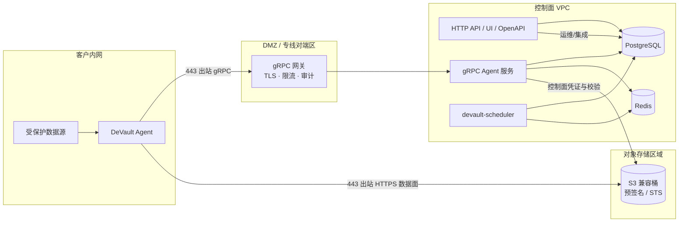

# 企业参考架构

**生产常见拆分**单页视图，便于安全评审。原则与控制/数据面见 [架构一页纸](../product/architecture.md) 与 [平台实现架构](../engineering/platform-architecture.md)；Helm 安装见 [Kubernetes（Helm）](./kubernetes-helm.md)。

## 网络分区与信任域

| 边界 | 说明 |
|------|------|
| **Agent → 网关** | 出站 TLS gRPC（Pull）；不暴露 Postgres/Redis 到客户侧 |
| **Agent → 对象存储** | 备份/恢复字节流；短时预签名 |
| **控制面 → 对象存储** | Manifest、Multipart 收尾、保留删除；可用 AssumeRole |

HTTP API：生产建议 TLS、OIDC/API Key/RBAC（见 [租户与访问控制](./tenants-and-rbac.md)）。

## 出站与防火墙

- **Agent**：网关 `443`、对象存储 `443`。
- **控制面**：Postgres、Redis、S3、（可选）STS；**无需**入连客户内网。

## 相关文档

- [TLS 与网关](../trust/tls-and-gateway.md)
- [gRPC 与 API 多实例](./grpc-multi-instance.md)
- [安全白皮书摘要](../trust/whitepaper.md)
