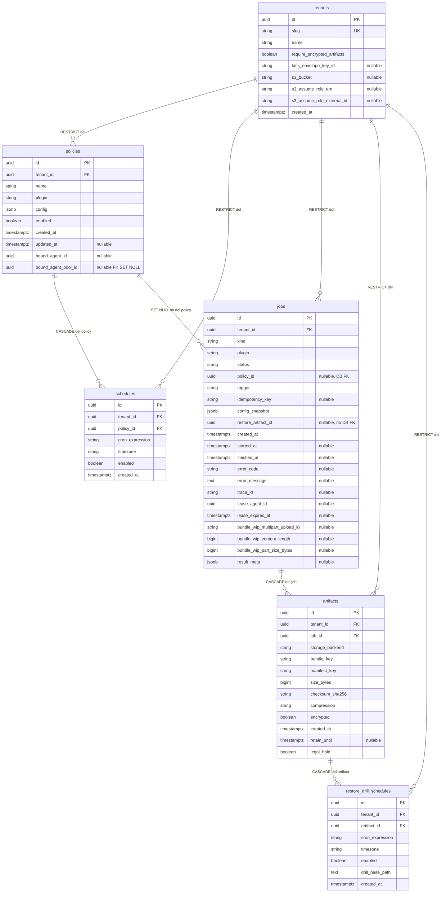
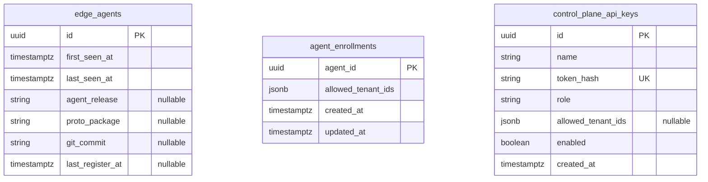

# 控制面数据库 ER 图

本文梳理 **控制面元数据库**（PostgreSQL）中与业务相关的表及外键关系，便于评审与排障。物理表名均带前缀 **`devault_`**（由 `src/devault/db/constants.py` 的 **`TABLE_PREFIX`** 统一配置；下图为逻辑名）。权威字段定义以仓库为准：

- ORM：`src/devault/db/models.py`
- 迁移：`alembic/versions/`

## 总览：多租户与作业域

**租户 `tenants`** 为策略、作业、artifact 及演练调度的隔离根；**`edge_agents`**、**`agent_enrollments`**、**`control_plane_api_keys`** 与租户业务表无外键，属独立运维域。

### 读图说明

| 关系 | 说明 |
|------|------|
| **policies → schedules** | 删除策略时级联删除其 Cron 行。 |
| **policies 执行绑定** | 可选 **`bound_agent_id`** 或 **`bound_agent_pool_id`**（互斥 CHECK）；池表 **`agent_pools`** / **`agent_pool_members`**（迁移 **`0012`**）。 |
| **policies → jobs** | 数据库存在 **`fk_jobs_policy_id_policies`**（`ON DELETE SET NULL`）。`policy_id` 可为空（例如部分恢复类作业）。ORM 未声明 `ForeignKey`，迁移与线上库仍以约束为准。 |
| **jobs → artifacts** | 外键 `job_id` **`ON DELETE CASCADE`**。应用层通常 **0..1** 条 artifact / 作业（ORM `Job.artifact` 为单对象）；数据库未对 `artifacts.job_id` 加唯一约束。 |
| **artifacts → restore_drill_schedules** | 按 artifact 配置恢复演练 Cron；删除 artifact 时级联删除相关演练调度。 |
| **jobs.restore_artifact_id** | 仅 UUID 字段，**无数据库外键**；由应用保证指向本租户 artifact。 |

**唯一约束**：`jobs` 上 **`(tenant_id, idempotency_key)`** 在 `idempotency_key` 非空时唯一（见 `UniqueConstraint` 与迁移 `0005`）。

---

## 独立表（fleet / 访问控制）

用于 Agent 清单、**租户登记**、**Agent 池**与 REST/gRPC 访问令牌。**`edge_agents` / `agent_enrollments` / `control_plane_api_keys`** 无外键到 **`tenants`**；**`agent_pools.tenant_id`** 外键到 **`tenants`**；**`policies.bound_agent_pool_id`** 外键到 **`agent_pools`**（`ON DELETE SET NULL`）。

- **`edge_agents`**：gRPC Register/Heartbeat 汇总的边缘 Agent 身份；`id` 为 Agent 侧稳定 UUID，**不引用 `tenants`**。  
- **`agent_enrollments`**：按 **`agent_id`** 绑定 **`allowed_tenant_ids`**（JSONB 租户 UUID 字符串列表）；**`Register`** 与会话路径的租户硬边界；与 **`tenants`** 无 DB 外键，写入时由 API 校验租户存在。  
- **`agent_pools` / `agent_pool_members`**：租户内 Agent 分组；成员 **`agent_id`** 须 **enrollment** 覆盖该租户；供 **`policies.bound_agent_pool_id`** 与 **`LeaseJobs`** 收窄。  
- **`control_plane_api_keys`**：控制面 API 密钥哈希；**`allowed_tenant_ids`** 为 JSON 可选租户白名单，非 FK。

---

## 延伸阅读

- [数据库迁移](../admin/database-migrations.md)  
- [租户与访问控制](../admin/tenants-and-rbac.md)  
- [对象存储模型](../storage/object-store-model.md)
