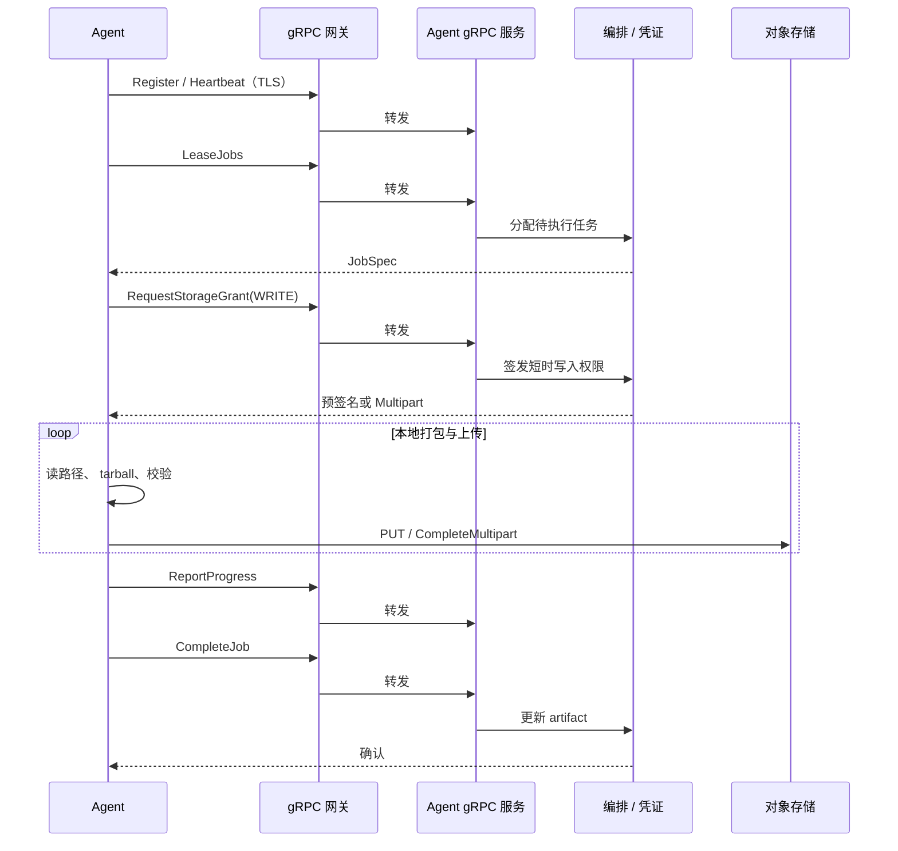

# 平台实现架构

承载 **原则、平面划分、交互序列与存储/安全约定**；信任域图示见 [架构一页纸](../product/architecture.md)。操作步骤见 [备份与恢复流程](../user/backup-and-restore.md)。

## 已定决策（摘要）

- **Pull**：Agent **主动**租约与上报。
- **gRPC 经网关（生产推荐）**：TLS、mTLS、限流、审计。
- **统一对象存储**：Artifact 落在 S3 兼容命名空间；通过前缀（env / tenant / job_id）隔离。

## 目标原则

| 原则 | 说明 |
|------|------|
| **边缘不连中间件** | Agent **不连接** Postgres/Redis |
| **控制与数据分离** | 大对象**不经** gRPC |
| **Pull** | Agent 拉取作业；控制面不入连客户侧 |
| **经网关** | 对外 TLS 与 LB；后端 gRPC 多实例（见 [gRPC 多实例](../admin/grpc-multi-instance.md)） |

## 控制面 vs 数据面

| 平面 | 路径 | 内容 |
|------|------|------|
| **控制面** | Agent →（网关）→ Agent gRPC | Register/Heartbeat、**LeaseJobs**、**RequestStorageGrant**、**ReportProgress**、**CompleteJob** |
| **数据面** | Agent → 对象存储 | Artifact 分片 / manifest / 校验 |

## Pull 备份成功序列

恢复路径对称：**RequestStorageGrant(READ)** → GET bundle → 展开 → **CompleteJob**。开发可省略网关直连 gRPC。

## 网关职责

TLS 终结、路由、（可选）mTLS/JWT、限流、观测与审计路由。后端多 **Agent gRPC**；示例见 [TLS 与网关](../trust/tls-and-gateway.md)。

## 统一存储

Artifact 落在平台运维的 **S3 兼容**集群，通过前缀或桶策略做多租户。**Agent** 仅有短时 PUT/GET 授权；控制面持久化 key、checksum、保留元数据。**BYOB** 见 [租户与访问控制](../admin/tenants-and-rbac.md) 与 [对象存储模型](../storage/object-store-model.md)。

## 安全摘要

- 网络：客户侧多为主动 **出站** **HTTPS**。  
- 身份：**mTLS** 或 **短期令牌**。  
- 存储：凭证 **按 job、按前缀** 限时最小集。

## 与当前仓库实现的映射

| 设计 | 仓库典型形态 |
|------|----------------|
| 边缘执行 | **`devault-agent`** |
| 控制面编排 | **FastAPI `api`**：`DEVAULT_GRPC_LISTEN`、`devault-scheduler` Cron |
| 队列语义 | Redis 锁 / PG 作业状态 |
| 水平扩缩 | **`api` 可多副本**（共享 PG/Redis）；**`scheduler` 单副本**；Agent 多实例；详见 [gRPC 与 API 多实例](../admin/grpc-multi-instance.md) |

演进见 [产品路线图](../product/roadmap.md) 与 **`CHANGELOG`**。
