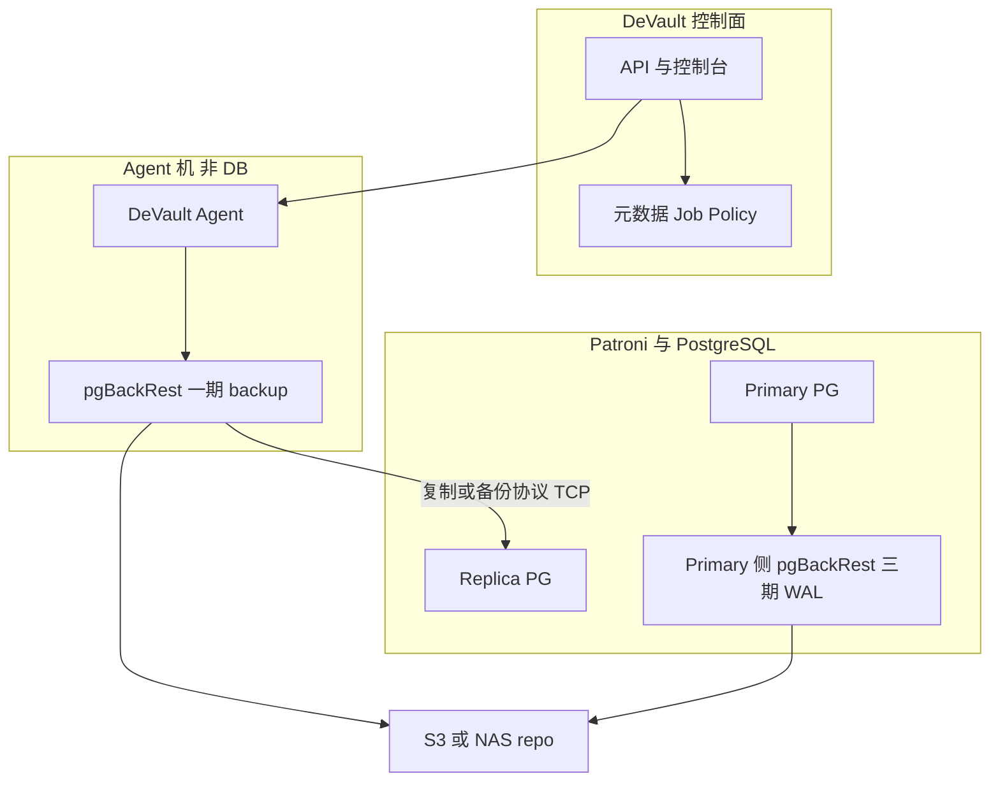
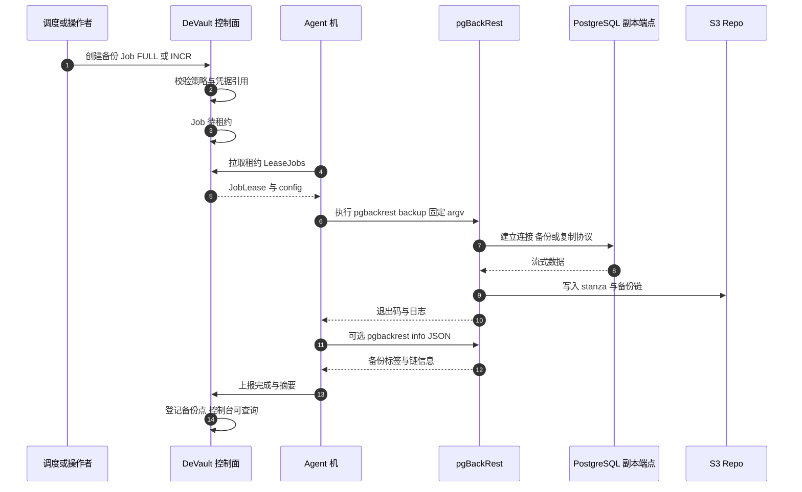
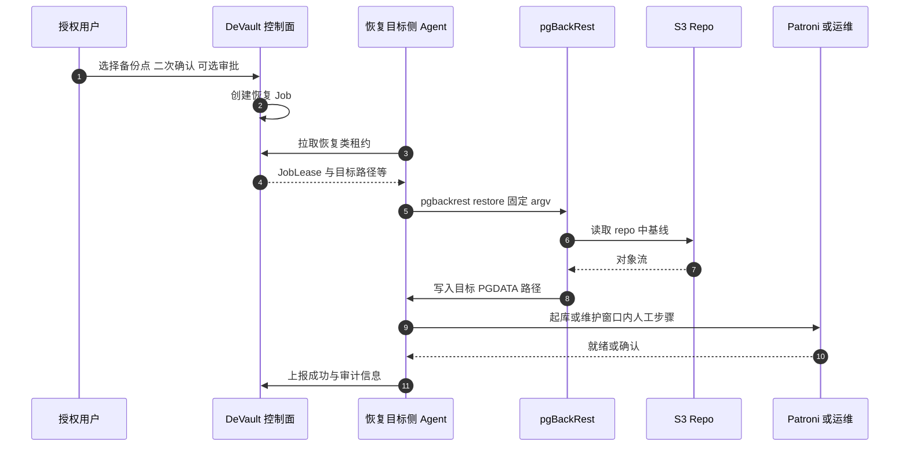
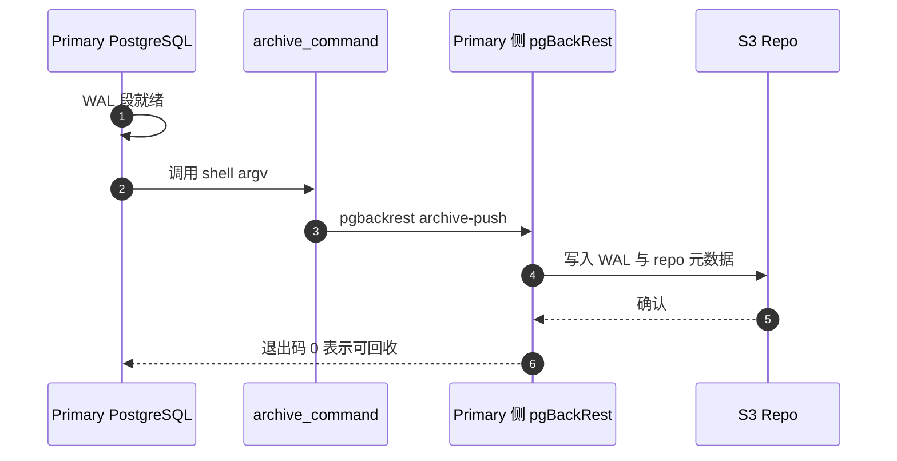

# PostgreSQL pgBackRest 物理备份总体方案（分三期）

本文档汇总 **Patroni** 部署形态下，使用 **pgBackRest** 做 **物理备份**、**S3 兼容对象存储** 为 repo、**DeVault 任务系统** 统一编排时的 **总体架构与分期交付边界**。与「控制面元数据库逻辑备份」（`pg_dump`，见 [控制面元数据库备份与 DR](../admin/control-plane-database-dr.md)）及「租户侧逻辑备份 MVP（`pg_dump` 插件）」正交，互不替代。

**权威参考**：pgBackRest [用户指南](https://pgbackrest.org/user-guide.html)（具体配置项以所选大版本文档为准）。

---

## 0. 背景与目标

| 维度 | 选择 |
|------|------|
| **数据库形态** | **Patroni** 管理的多副本 PostgreSQL |
| **Repo** | **S3 兼容**（含 MinIO）；建议 **单 bucket + 独立 prefix**（按集群 / 租户隔离） |
| **执行拓扑** | **DeVault Agent 与 pgBackRest 同机**，该机 **不是 DB 机**；`pgbackrest backup` 通过 **TCP（复制/备份协议）** 从 PG 拉取数据流，由 pgBackRest 写入 **S3 repo**（或后续将 **NAS 挂载点** 配置为 repo 本地路径，数据流仍经 Agent 机写入该卷） |
| **编排** | **DeVault Policy / Schedule / Job** 触发与审计；任务系统可演进为支持 **「repo 引用型」结果**（备份标签、`info` JSON 摘要等），不必等价于现有「单文件 artifact」模型 |

### 0.1 分期总览

| 期 | 范围 | RPO / 能力边界（对外需写清） |
|----|------|------------------------------|
| **一期** | **FULL + INCR** 的 `pgbackrest backup` 编排、repo 写入、登记与可观测 | RPO 近似 **成功备份间隔**；**无**连续 WAL 时 **无** 任意时间点 **PITR** |
| **二期** | **恢复**（`restore` / 与 Patroni 配合的起库流程）产品化与治理 | 可恢复到 **备份链可达的一致性点**；**三期未上前** 仍无「秒级～分钟级任意时间点」级 PITR |
| **三期** | **WAL 归档**（`archive_command` + `archive-push` 进入 **同一** repo）与积压治理 | RPO 可显著缩短；具备 **PITR** 基础 |

### 0.2 与「全量 / WAL 分阶段」的关系

- **一期**可 **仅交付 FULL + INCR**，暂不启用 **持续 WAL 归档**；与 **RPO 指标** 相关，与 **备份任务是否可运行** 无硬耦合。  
- **repo / stanza / IAM prefix** 建议从 **一期** 起按「**三期将接入同一 repo**」设计，避免后期换桶或换 prefix 导致备份链难以衔接。

---

## 1. 架构与数据流

### 1.1 组件分工

```text
┌─────────────────────────────────────────────────────────────┐
│  Patroni 集群（PostgreSQL + Patroni；Leader / Replica）        │
│  一期：提供备份流端点；三期：Primary 上 archive_command        │
└─────────────────────────────────────────────────────────────┘
         │  复制/备份协议（TCP；pg_hba + 专用备份角色）
         ▼
┌─────────────────────────────────────────────────────────────┐
│  Agent 机（非 DB 机）：DeVault Agent + pgBackRest              │
│  执行：pgbackrest backup（FULL / INCR / 后续可选 DIFF）         │
└─────────────────────────────────────────────────────────────┘
         │
         ▼
┌─────────────────────────────────────────────────────────────┐
│  S3（或 Agent 挂载的 NAS 作为 repo 路径）                       │
│  pgBackRest 独占对象布局；DeVault 不解析内部对象语义             │
└─────────────────────────────────────────────────────────────┘
         ▲
         │  策略 / 调度 / 审计 / 控制台
┌─────────────────────────────────────────────────────────────┐
│  DeVault 控制面                                                │
└─────────────────────────────────────────────────────────────┘
```

#### 1.1.1 逻辑架构图（Mermaid）

下图与上文 ASCII 示意一致：展示 **控制面编排**、**Agent 机上的 backup**、**Replica 上的备份流**、**S3 repo**，以及 **三期** 在 **Primary** 侧经 pgBackRest 写入 **同一 repo** 的 WAL 归档路径。



### 1.2 「备份流」与「WAL 归档」路径说明（避免误解）

| 路径 | 发起位置 | 典型数据流 | 分期 |
|------|-----------|------------|------|
| **FULL / INCR（`backup`）** | **Agent 机**上由 DeVault Job 调起 | **DB →（TCP 流）→ Agent 上 pgBackRest → S3 / NAS repo** | **一期** |
| **WAL 段归档（`archive-push`）** | **DB 机**上由 PostgreSQL **`archive_command`** 调起 | 常见为 **DB → S3**（同一 repo，**不经** Agent 机中转） | **三期** |

**要点**：物理全量/增量 **不要求** 在 Agent 机上 **NFS 挂载 DB 的 PGDATA**；流式备份通过协议拉取。若坚持 **DB 机完全不部署 pgBackRest**，则 WAL 进同一 repo 会显著复杂化，**不推荐**；三期推荐在 **Primary** 上部署轻量 **`archive-push`**（与 Agent 机上的 **`backup`** 分工并存）。

### 1.3 Patroni 下注意点

- **备份连接目标**：优先连 **Replica** 以减负主库；需 **稳定端点** 或 **Failover 后刷新**（DNS、服务发现、或 DeVault 下发当前只读副本地址）。  
- **权限**：`pg_hba.conf` 允许从 **Agent 机网段** 使用 **备份/复制** 所需角色连接。  
- **Failover**：新 Primary 上 **三期** 的 `archive_command` 必须仍指向 **同一 stanza 的 repo**；一期、二期不涉及归档时亦建议在模板中 **预留开关**，默认关闭直至三期。

### 1.4 时序图（按分期）

以下时序图描述 **逻辑交互**；DeVault 边缘执行细节以仓库当前 **gRPC（如 LeaseJobs、CompleteJob）** 与后续实现为准，可与此对齐做实现级序列图。

#### 1.4.1 一期：FULL / INCR 备份（Agent 机执行 `backup`）



#### 1.4.2 二期：恢复（示意，含人工与 Patroni 步骤）



#### 1.4.3 三期：WAL 归档（Primary 上 `archive-push`，不经 Agent 机）



---

## 2. 一期：全量（FULL）+ 增量（INCR）

### 2.1 目标

- 在同一 **stanza**、同一 **S3 repo** 下，稳定跑通 **FULL** 与 **INCR** 的 `pgbackrest backup`。  
- 由 DeVault **Schedule / 手动** 创建 Job，在 **Agent 机** 以 **固定 argv** 执行（禁止 `shell=True`），将结果写入控制面（备份类型、时间、stanza、`pgbackrest info` 摘要、成功/失败原因等）。  
- **明确不做**：产品化恢复（见二期）、WAL 连续归档与 PITR（见三期）。

### 2.2 pgBackRest / PostgreSQL 配置要点

1. **Stanza**  
   - 每 Patroni 逻辑集群一个 **stanza 名**；与 **S3 prefix**、租户/集群 id 对齐，便于 IAM 与审计隔离。

2. **连接与 `pg-*`（配置在 Agent 机可读的配置片段中）**  
   - **`pg1-host` / `pg1-port`**：指向用于备份的实例（常为 **Replica**）。  
   - **`pg1-path`**：该实例上的 **`PGDATA` 路径**（元信息需要；**不要求** Agent 挂载该目录）。  
   - **凭据**：专用备份用户；密码等仅来自 **Secret**，**不**写入 DeVault `config_snapshot` 明文。

3. **Repo（S3）**  
   - 配置 `repo` 类型、bucket、region、prefix、凭证（优先 **IAM Role** / IRSA / 实例配置）。  
   - **加密**：桶默认 SSE（如 KMS）+ 可选 pgBackRest **repo 加密**；密钥轮换单独流程。

4. **FULL 与 INCR**  
   - **必须先有至少一次成功 FULL**，同一链上才可做 **INCR**（pgBackRest 链式语义）。  
   - 建议策略示例：**每 N 天 FULL** + **每 N 小时 INCR**（按变更量与成本调参）。  
   - **保留与过期**：配置 **retention / `expire`**，避免 repo 无限增长；`expire` 可由 **独立定时 Job** 或在某次 `backup` 成功后触发（择一并在运维手册中固定）。

5. **WAL**  
   - 一期 **不启用** `archive_mode` / `archive_command` 写入本 repo，或 Patroni 模板中 **默认关闭**，避免「半成品归档」状态。

### 2.3 DeVault 任务与数据模型（建议）

- **Policy**：`stanza`、`repo_ref`（bucket + prefix）、FULL/INCR 调度策略、`target_role`（如 replica-first）、`secret_ref`、`patroni_scope` / `cluster_id`（可选）。  
- **Job**：新插件类型（如 `postgres_pgbackrest`）；`config_snapshot` 仅存 **非敏感** 与枚举（`FULL` / `INCR`）。  
- **长任务**：租约续期、超时、`ReportProgress`（可结合日志或阶段性 `info`）。  
- **结果登记**：不强制「单文件下载」；登记 **`backup_label`（或等价）**、起止时间、类型、stanza、repo 指针、`pgbackrest info --output=json` 摘要、退出码；控制台展示 **备份点列表**（与文件类 artifact 区分 UI）。

### 2.4 可观测与安全

- **指标**：上次成功 FULL/INCR 时间、失败率、备份耗时；可选 **复制延迟** 探针（防止 replica 过旧导致备份失败）。  
- **日志**：结构化字段 `job_id`、`stanza`、`cluster_id`、`backup_type`。  
- **安全**：S3 **最小权限** prefix；固定 argv。

### 2.5 一期验收建议

- 约定窗口内：**FULL 成功**、**INCR 成功**、**expire 不破坏链**（抽检 `info`）。  
- **Failover 演练**：连接目标刷新后 **INCR 成功** 或 **按设计触发新 FULL**。  
- DeVault：**策略 → Job → 列表/详情** 闭环；失败可定位到 pgBackRest 错误摘要。

### 2.6 内部质量门（可选）

- 至少一次 **运维人工** `pgbackrest restore` 到隔离环境验证链可用（不阻塞一期产品发版条款由项目自定）。

---

## 3. 二期：恢复（Restore）

### 3.1 目标

- 将 **从指定备份集恢复** 纳入 DeVault：**恢复 Job**、强确认、RBAC（如仅 `tenant_admin` / `platform`）、审计。  
- **文档化** 与 Patroni 的配合步骤（维护窗口、是否新成员、时间线、是否由 Patroni 重新 bootstrap 等）。**DeVault 不替代 Patroni** 的集群状态机。

### 3.2 范围建议

| 模式 | 说明 | 建议优先级 |
|------|------|------------|
| **新实例 / 空目录恢复** | 恢复到空 `PGDATA` 的新实例；最常见教学路径 | **二期优先交付** |
| **替换生产实例** | 高危；需维护窗口 + Patroni API / 人工步骤 | **二期以 runbook + 演练** 为主，慎用「一键」 |

### 3.3 执行位置与一期拓扑的衔接

- `pgbackrest restore` 通常在 **持有目标数据目录的机器** 上执行。若目标为 **新 Patroni 成员**，Agent 可能需要落在 **该成员节点** 或与 **数据卷挂载** 一致——二期须在方案中 **固定一种受支持拓扑**，并与一期「备份始终在非 DB Agent」的叙述 **并列说明**（备份与恢复允许 **不同 Agent 池**）。

### 3.4 DeVault 交互建议

- 用户选择 **备份点**（来自一期登记）→ **二次确认** → 可选 **审批**。  
- Job 步骤示例：`preflight`（磁盘、`pgbackrest info`）→ `restore` → `post`（Patroni 起库、健康检查）。  
- **三期未上时**：界面与文档须写明恢复目标为 **备份链一致性点**，**非** 任意时间点 PITR。

### 3.5 二期验收建议

- **新实例恢复** 路径至少一次端到端成功；**替换生产** 路径有书面 runbook 并完成一次演练。  
- 无权限主体 **无法** 触发恢复 Job；审计记录完整。

---

## 4. 三期：WAL 归档

### 4.1 目标

- 在 Patroni **当前 Primary** 上启用 **`archive_mode`** 与 **`archive_command`**，调用 **`pgbackrest ... archive-push`**，写入 **与一、二期同一 stanza 的 S3 repo**。  
- **归档延迟 / 失败** 监控与告警；与 **复制槽**、**WAL 保留** 策略对齐，防止主库 WAL 堆积。

### 4.2 数据路径（与一期 Agent 的关系）

- **WAL**：由 **DB 机** PostgreSQL 调用 `archive_command`；典型路径 **DB → S3**（与 Agent 机上的 `backup` **共享 repo**，由 pgBackRest 维护）。  
- **Agent 机**：继续执行 **FULL/INCR**；与归档 **并存**。

### 4.3 三期验收建议

- **RPO** 达到设计值（依赖归档延迟、`archive_timeout`、网络等）。  
- **PITR 演练**：`recovery_target_time`（或等价）成功；步骤写入 runbook 并与 Patroni 流程对齐。  
- **积压告警**：`pg_stat_archiver` 或 pgBackRest 状态与 DeVault/告警平台联动。

---

## 5. 跨期统一约定

1. **repo / stanza / IAM prefix** 从 **一期** 固定，避免二、三期换桶或换 prefix 导致链断裂。  
2. **对外文档** 每期写清：**RPO、是否支持 PITR、Patroni 侧谁负责哪些操作**。  
3. **INCR 链** 依赖 **定期 FULL**；监控「距上次 FULL 过久」并 **告警或自动触发 FULL**。  
4. **DeVault 与 pgBackRest 边界**：DeVault 负责 **编排、凭证边界、多租户隔离、审计与控制台**；**repo 内对象布局** 由 pgBackRest **独占**，DeVault 不依赖内部对象列表做业务逻辑。

---

## 6. 文档化交付物清单（可按项目裁剪）

| 期 | 建议交付物 |
|----|------------|
| **一期** | 架构图、pgBackRest 配置模板、Patroni 连接与权限清单、S3 IAM、Schedule 与 FULL/INCR 策略、`expire` 策略、DeVault Job/Policy 字段说明、备份失败排查 TOP N |
| **二期** | 恢复 runbook、Patroni 配合步骤、权限矩阵、演练记录模板 |
| **三期** | 归档参数说明、RPO/SLO、积压与应急、PITR 演练步骤 |

---

## 7. 修订记录

| 日期 | 说明 |
|------|------|
| 2026-05-12 | 初版：整合 Patroni、S3、Agent 非 DB 机、DeVault 编排及 FULL/INCR → 恢复 → WAL 三期边界 |
| 2026-05-12 | 补充 Mermaid 逻辑架构图与一期备份、二期恢复、三期 WAL 时序图 |
