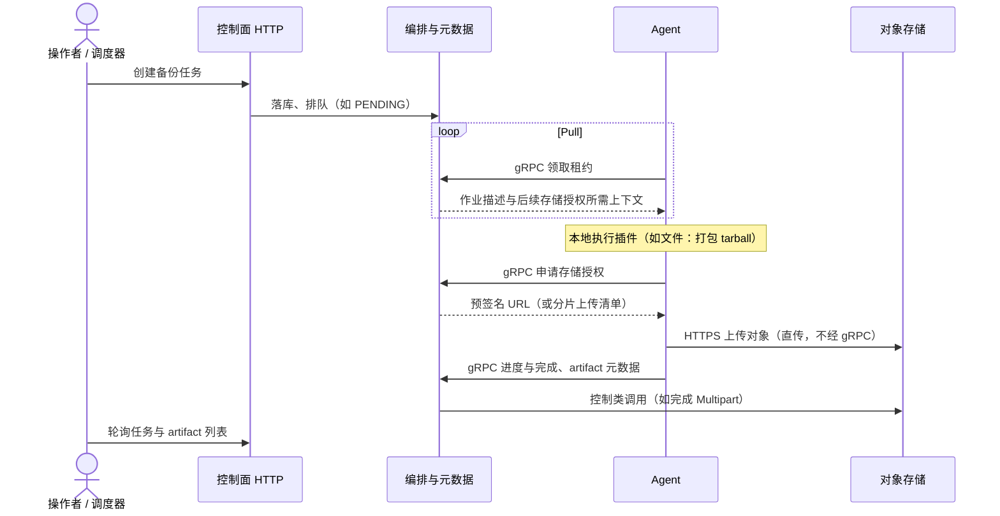
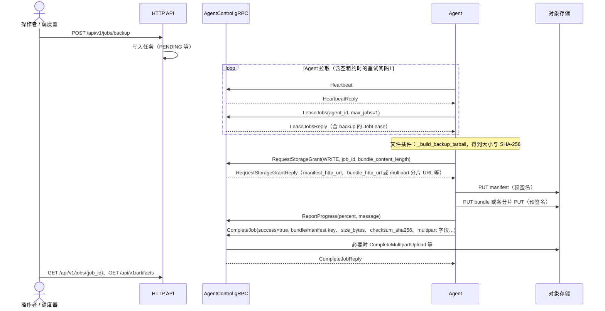
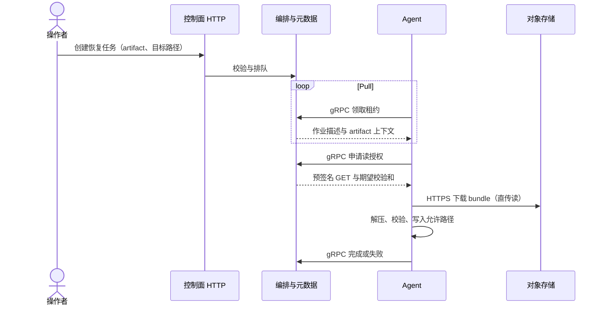
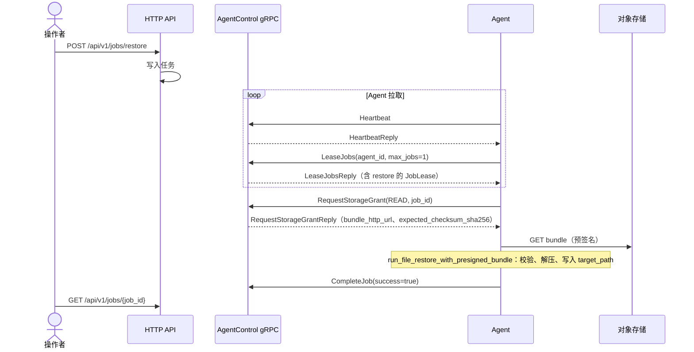

# 备份与恢复流程

本章说明 **备份/恢复在控制面与数据面如何协作**（含多层时序图），并给出 **HTTP API** 与可选 **CLI** 的操作步骤。体系结构总览见 [架构概览](../intro/architecture-overview.md)。

## 设计要点（控制面 vs 数据面）

- **控制面**：经 **HTTP** 创建/查询任务与 artifact；经 **`AgentControl` gRPC**（`proto/agent.proto`）发放租约、存储授权、接收进度与完成回调；在 `s3` 后端下 **签发预签名** 并记录对象 key、artifact 元数据。
- **数据面**：Agent 使用预授权，经 **HTTPS** 与 **S3 兼容存储** 直传读写；**大对象不经过 gRPC**。
- **Pull**：Agent **主动**调用 `LeaseJobs` 领取作业；控制面不向 Agent 内网入连。

首启且未配置 `DEVAULT_API_TOKEN` 时，Agent 可先调用 **`Register`** 用一次性密钥换取 Bearer（见 `agent.proto` 注释）；日常循环中还会发送 **`Heartbeat`**。大对象分片、恢复侧流式与重试见 [大对象与恢复](../storage/large-objects.md) 与 [存储调优](../storage/tuning.md)。

---

## 备份

### 跨角色总览

从操作者创建任务到 Agent 直传对象存储、控制面收尾，只保留主要阶段，**不展开**具体 RPC 名与分片次数。



### 租约、存储授权与上传收尾

与当前 **文件备份** 实现一致：`LeaseJobs` 返回 `JobLease` 后，Agent 在本地生成 tarball 与 manifest，再调用 **`RequestStorageGrant`**（`STORAGE_INTENT_WRITE`，携带 `bundle_content_length`）；应答中为 manifest / bundle 提供预签名 URL，或在大对象场景下提供 **multipart** 分片 PUT 与 `bundle_multipart_upload_id`；上传后 **`ReportProgress`**，最后 **`CompleteJob`** 携带校验和与（若适用）multipart 完成信息，控制面在成功路径上完成 **artifact** 登记及 S3 侧 **CompleteMultipartUpload** 等操作。



失败时 Agent 会 **`CompleteJob(success=false, error_code, error_message)`**；同一 RPC 也用于向控制面报告不可恢复错误，图中省略分支以保持可读。

---

## 恢复

### 跨角色总览



目标路径必须在 Agent 的 **`DEVAULT_ALLOWED_PATH_PREFIXES`** 内；覆盖非空目录需在 API 中显式确认（见下文）。

### 租约、存储授权与本地还原

文件恢复路径：领到 **`JobLease`（restore）** 后调用 **`RequestStorageGrant`**（`STORAGE_INTENT_READ`），应答必须带 **`expected_checksum_sha256`**（或配置中提供）；Agent 使用 **`bundle_http_url`** 拉取对象，校验后解压到目标路径，最后 **`CompleteJob(success=true)`**。



---

## 备份（API 步骤）

1. 调用 **`POST /api/v1/jobs/backup`**，请求体包含插件类型与配置（文件插件示例见 [快速开始](../intro/quickstart.md)）。
2. 记录响应中的 **`job_id`**。
3. 轮询 **`GET /api/v1/jobs/{job_id}`** 直到 `status` 为终态（如 `success` / `failed`）。
4. 成功后可通过 **`GET /api/v1/artifacts`** 列出可恢复产物。

## 恢复（API 步骤）

1. 在 Agent 可达路径下准备**空目录**（或明确允许覆盖非空目录，见下）。
2. 调用 **`POST /api/v1/jobs/restore`**，提供 `artifact_id` 与 `target_path`。
3. 若目标目录非空，需显式 `confirm_overwrite_non_empty: true`（CLI 对应 `--force`）。
4. 轮询任务至成功，在目标路径下检查文件树。

## CLI（可选）

安装本仓库后可用 `devault` 子命令简化上述流程，例如：

```bash
pip install -e .
devault file backup /data/sample
devault job wait <job_id>
devault artifact list
devault file restore <artifact_id> --to /restore/out2 --force
```

详见仓库根 `README.md` 中的 CLI 小节。
