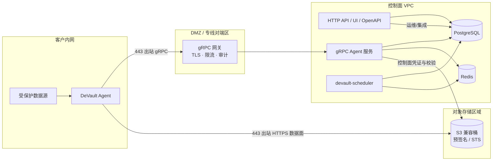

# 企业部署参考架构

本文给出**生产常见拆分**下的单页视图，便于安全评审与网络策略对齐。原则、控制面/数据面划分与 Pull 序列见 [目标架构](../intro/target-architecture.md)；信任域组件图亦见 [架构概览](../intro/architecture-overview.md)。实现以仓库代码与 `deploy/` 编排为准。

## 网络分区与信任域

## 读图要点

| 边界 | 说明 |
|------|------|
| **Agent → 网关** | 仅 **出站** **TLS** **gRPC**（Pull、租约、进度、Register）；不在客户内网暴露控制面 Postgres/Redis。 |
| **Agent → 对象存储** | **备份/恢复字节流**；使用控制面下发的 **预签名 URL**（或等效短期授权）；大流量不经 gRPC。 |
| **控制面 → 对象存储** | 清单读取、`HeadObject`、Multipart 完成、保留期删除等；凭证可为 **AssumeRole** 短时会话（见 [STS 与 AssumeRole](../storage/sts-assume-role.md)）。 |
| **HTTP API** | 供运维、自动化与简易 UI；生产建议 **TLS 终结**、**mTLS/OIDC/API Key** 与 [访问控制](../reference/access-control.md) 一致。 |

## 出站与防火墙

- **Agent**：允许到 **网关 FQDN:443** 与 **对象存储端点:443**（若使用 path-style 或自定义端口，按云厂商文档放行）。
- **控制面**：到 Postgres、Redis、对象存储 API、（若启用）**STS** 端点；**无需**入连客户内网。

## 与高可用说明的关系

多实例 **API + gRPC**、**scheduler 单副本**、Redis 策略锁等见 [gRPC 与 API 多实例](grpc-multi-instance.md)。TLS / Envoy 示例见 [TLS 与网关](../security/tls-and-gateway.md)。

## 相关文档

- [目标架构（边缘 Agent + 控制面）](../intro/target-architecture.md)
- [安全白皮书摘要](../security/security-whitepaper.md)
- [备份完整性告警](./observability.md#backup-integrity-and-sla-alerts)
