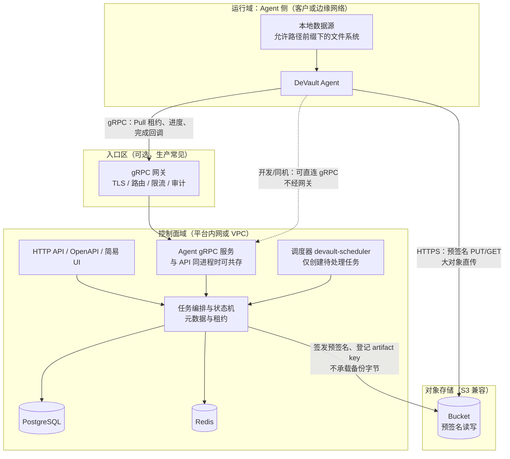
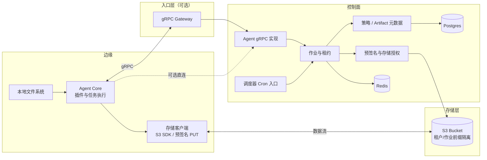

# 架构概览

本文只说明 **部署与信任边界**、**逻辑职责划分**、以及 **控制信令与对象存储数据面** 的关系；**备份/恢复在 API、gRPC、Agent、S3 之间的时序与操作细节**见 [备份与恢复流程](../guides/backup-and-restore.md)。实现以仓库代码与 `deploy/` 编排为准。

## 设计目标

| 目标 | 说明 |
|------|------|
| **控制与数据分离** | 作业描述、租约、进度、存储授权等走 **gRPC**；**备份字节流**经 **S3 兼容 API**（预签名 URL）直传，不经由 gRPC 载荷 |
| **Pull** | **Agent 主动**拉取租约并上报状态，控制面**不主动入连** Agent 所在网络，便于出站防火墙与 NAT |
| **边缘最小权限** | Agent **不连接** PostgreSQL / Redis；仅持有本作业相关的预签名或等价短期授权 |
| **可扩展入口（可选）** | 生产可在 Agent 与控制面之间加 **gRPC 网关**（TLS 终结、mTLS、限流、审计），后端 gRPC 可多实例 |

本地 **Docker Compose** 常将控制面与 Agent **同机**运行；下图按**生产常见拆分**绘制信任域，便于与「全栈挤在一台笔记本」对照理解。

---

## 总体架构（信任域与数据面）

下图强调三件事：**谁连谁**、**控制信令与字节流分离**、**对象存储在数据面中的位置**。

**读图要点**

- **实线 Agent → 网关 → gRPC 服务**：对外统一控制入口；开发环境可将 **网关省略**，Agent 直连 `DEVAULT_GRPC_TARGET`（图中虚线表示可选直连）。
- **实线 Agent → 对象存储**：备份/恢复的**主流量路径**落在 HTTPS 上；Agent 使用控制面下发的 **预签名 URL**（或等价短期授权），**不**持有平台根密钥。
- **控制面 → 对象存储**：元数据、清单、完成分片上传等**控制类**调用；**不替代** Agent 的大流量上传/下载。

`DEVAULT_STORAGE_BACKEND=s3` 时才会走上述预签名与直传路径；纯本地开发部分测试仍可使用非 S3 后端（见 [本地开发环境](../development/local-setup.md)）。

---

## 逻辑组件（按职责）

下图按**模块职责**拆分，不强制一一对应微服务进程；当前仓库中 **HTTP 与 Agent gRPC 常在同一 `api` 进程**，**调度器**为独立进程 `devault-scheduler`。

| 组件 | 职责 |
|------|------|
| **Agent Core** | 维持 gRPC 会话；**Pull** 租约；驱动文件等插件；按授权访问本地路径与 S3 |
| **存储客户端** | 分片上传、重试、恢复侧流式与校验（见 [大对象与恢复](../storage/large-objects.md)） |
| **Agent gRPC 实现** | 租约发放、心跳、进度、完成/失败等与 Agent 的 RPC 契约（见 [gRPC 参考](../reference/grpc-services.md)） |
| **作业与租约** | 任务状态机、并发锁、取消与重试 |
| **调度器 Cron 入口** | 仅根据 Cron **创建**待处理任务，**不**执行备份体 |
| **预签名与存储授权** | 在 `s3` 后端下生成预签名 URL，使 Agent 能直传 |
| **策略 / Artifact 元数据** | 持久化策略、调度、artifact 索引等 |

---

## 与仓库进程的对照

| 概念 | 仓库中的典型形态 |
|------|------------------|
| HTTP API / OpenAPI / UI | `uvicorn devault.api.main:app`（`deploy` 中 **api** 服务） |
| Agent gRPC | 与上者**同一进程**内监听 `DEVAULT_GRPC_LISTEN`（如 `:50051`） |
| 调度器 | 独立容器/进程 **`devault-scheduler`**，**不**执行 `alembic` |
| Agent | **`devault-agent`**，仅配置 gRPC 目标与 `DEVAULT_ALLOWED_PATH_PREFIXES` |
| 数据库迁移 | 默认仅 **api** 启动时 `alembic upgrade head`（见 [数据库迁移](../install/database-migrations.md)） |

---

## 延伸阅读

- [备份与恢复流程](../guides/backup-and-restore.md)（时序、控制面与数据面协作、API 操作步骤）
- [Agent 连接与安全](../security/agent-connectivity.md)
- [TLS 与网关](../security/tls-and-gateway.md)
- [对象存储模型](../storage/object-store-model.md)
- [端口与路径速查](../reference/ports-and-paths.md)
