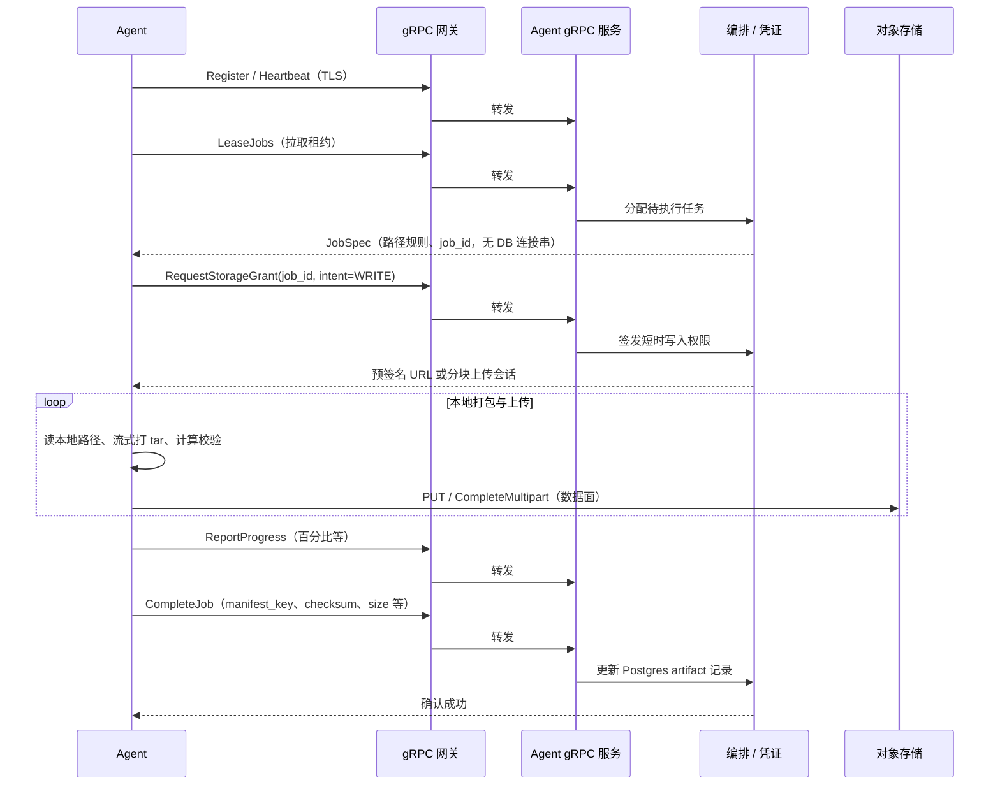

# 目标架构（边缘 Agent + 控制面）

> 本文承载原「目标架构方案」中的**原则、平面划分、交互序列与存储/安全约定**；信任域与逻辑组件的**图示速览**见 [架构概览](./architecture-overview.md)。备份/恢复逐步操作见 [备份与恢复流程](../guides/backup-and-restore.md)。

## 已定决策（摘要）

- **Pull 任务拉取**：Agent 主动租约与上报，控制面不主动入连客户内网。
- **gRPC 经网关暴露（生产推荐）**：TLS、mTLS、限流、审计等在入口层完成；开发环境可直连 gRPC。
- **统一对象存储**：Artifact 落在平台运维的 S3 兼容桶，通过前缀（含 **env / tenant / job_id** 等）隔离；首版不强制 **BYOB**（客户自带 Bucket 为后续扩展）。

## 背景与问题陈述（设计动机）

若备份执行单元下沉到客户网络，却仍要求直连控制面的 **PostgreSQL / Redis** 等中间件，会扩张攻击面，且不符合「边缘仅暴露控制信令与数据通道」的预期。

**目标态**：边缘只部署 **Agent**；Agent **不连接** 元数据库与内部 Redis；**控制信令**走 **gRPC**（建议经网关）；**备份字节流**仅经 **统一对象存储 API**（预签名 / STS / 分块上传等），**不经 gRPC 传大对象本体**。

## 目标原则

| 原则 | 说明 |
|------|------|
| **边缘不连中间件** | Agent 不配置、不连接 Postgres、Redis；仅连接 **gRPC 端点**（经网关或直连）与 **对象存储 API**。 |
| **控制与数据分离** | gRPC 承载作业描述、租约、进度、存储授权元数据；**大对象不经过 gRPC**。 |
| **Pull** | Agent **主动**拉取任务租约并上报状态；控制面**不主动入连**客户内网（适配出站防火墙与 NAT）。 |
| **经网关** | 对外统一入口：TLS、路由、限流、观测；后端 gRPC 可多实例水平扩展（见 [gRPC 多实例](../install/grpc-multi-instance.md)）。 |
| **统一存储** | Artifact 落在 **平台托管**的 S3 兼容命名空间；通过 **前缀或桶策略** 做多租户与作业隔离。 |

## 控制面 vs 数据面

| 平面 | 路径 | 内容 |
|------|------|------|
| **控制面** | Agent →（网关）→ Agent gRPC 服务 | 注册/心跳、**LeaseJobs**、进度、**CompleteJob**、失败原因、**RequestStorageGrant**（返回预签名 URL 等）。 |
| **数据面** | Agent → 对象存储 | Artifact 分块、manifest、校验大流量；**不经 gRPC 传文件本体**。 |

## Pull 模式交互序列（备份成功路径）

恢复路径对称：**RequestStorageGrant(intent=READ)** → Agent 从对象存储拉取 bundle → 本地展开 → **CompleteJob**。开发环境可将 **Agent → 网关 → 服务** 简化为 **Agent → 服务** 直连（与 [架构概览](./architecture-overview.md) 中虚线一致）。

## 网关层说明

网关不改变 **Pull** 语义，只改变**入口形态**：

- **职责**：TLS 终结、SNI/路由、gRPC 健康检查（可按环境配置）、连接限流、可选 JWT/mTLS、审计日志。
- **常见实现**：Envoy、nginx（gRPC）、云厂商负载均衡 + 后端、Traefik 等。
- **后端**：一至多个 **Agent gRPC** 实例，由网关做负载均衡。

实现与证书示例见 [TLS 与网关](../security/tls-and-gateway.md)。

<h2 id="unified-storage-extensions">统一存储与后续扩展</h2>

**含义**：Artifact 落在平台运维的 S3 兼容集群（如 MinIO、云厂商账号下 Bucket），通过 **前缀或 Bucket 策略** 隔离租户与作业（与 [对象存储模型](../storage/object-store-model.md) 一致）。

| 项 | 说明 |
|----|------|
| **Agent 侧** | 仅持有**短时**上传/下载凭证；不嵌入平台永久 Access Key。 |
| **控制面侧** | 持久化 `bundle_key`、`manifest_key`、checksum、大小等；保留期删除与审计针对统一命名空间。 |
| **后续扩展（未实现）** | **BYOB**：客户自有桶与跨账号角色；仍保持「数据面只走对象存储、gRPC 不传备份体」原则。 |

## 安全摘要

- **网络**：客户侧通常仅开放 **出站 HTTPS** 至网关与存储端点。
- **身份**：推荐 **mTLS** 或 **短期访问令牌**（如 Register 引导）；REST/UI 侧见 [访问控制](../reference/access-control.md)。
- **权限**：存储凭证 **按 job、按前缀** 限时、限操作（Put/Get/List 等最小集）。
- **审计**：作业创建、租约、完成在 Postgres 留痕；gRPC 可启用审计日志（见 [可观测性](../install/observability.md)）。

## 与当前仓库实现的对照

| 设计叙述 | 当前仓库典型形态 |
|----------|------------------|
| 边缘执行单元 | **`devault-agent`**：gRPC Pull + 预签名直传 S3；不连 Postgres/Redis |
| 控制面编排 | **FastAPI `api` 进程**：HTTP、gRPC（`DEVAULT_GRPC_LISTEN`）、租约与 **CompleteJob**；**`devault-scheduler`** 按 Cron **创建**待处理任务 |
| 内部队列 | **已不使用 Celery**；策略级互斥等使用 **Redis**；任务状态在 **PostgreSQL** |
| 数据源挂载 | **Agent** 所在主机挂载数据源；控制面容器不挂载客户数据路径 |
| 任务创建 | **HTTP API** / UI / 调度器写库；边缘仅 gRPC + 存储 |

演进路线与数据库等扩展见 [路线图](./roadmap.md) 与仓库 `CHANGELOG`。
