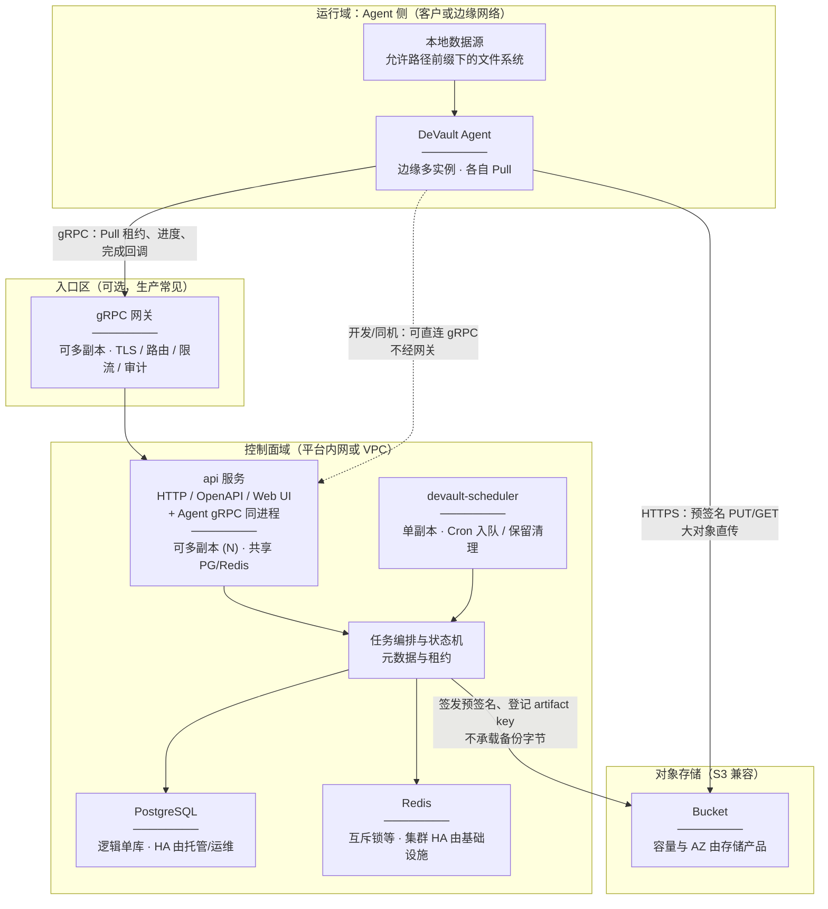
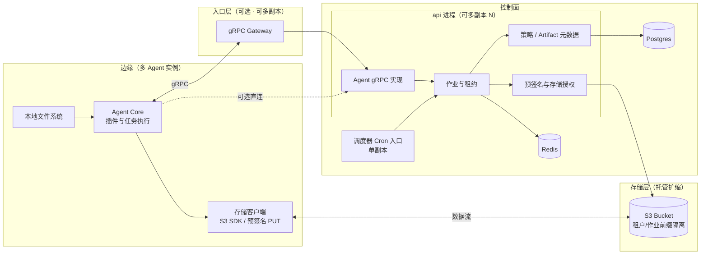

# 架构一页纸

本文给出 **对外评审与售前**可用的控制面 / 数据面划分与信任域图示；Pull 序列、RPC 要点与实现对照见 [平台实现架构](../engineering/platform-architecture.md)。端到端操作时序见 [备份与恢复流程](../user/backup-and-restore.md)。

## 设计目标

| 目标 | 说明 |
|------|------|
| **控制与数据分离** | 作业描述、租约、进度、存储授权走 **gRPC**；**备份字节流**经 **S3 兼容 API**（预签名 URL）直传 |
| **Pull** | **Agent 主动**拉取租约并上报状态，控制面**不主动入连** Agent 侧网络 |
| **边缘最小权限** | Agent **不连接** PostgreSQL / Redis；仅持有本作业相关的预签名或短期授权 |
| **可扩展入口** | 生产可在 Agent 与控制面之间部署 **gRPC 网关**（TLS、mTLS、限流、审计） |

## 总体架构（信任域与数据面）

**读图要点**

- **Agent → 网关 → api（含 gRPC）**：对外统一控制入口；开发环境可省略网关，Agent 直连 `DEVAULT_GRPC_TARGET`。**api 可无状态水平扩展**；**scheduler 须单副本**（当前实现下多副本会重复 Cron）。详见 [gRPC 与 API 多实例](../admin/grpc-multi-instance.md)。
- **Agent → 对象存储**：备份/恢复的**主流量**；Agent 使用控制面下发的**预签名 URL**，默认不嵌入平台永久根密钥。
- **控制面 → 对象存储**：清单、multipart 收尾、HEAD 与保留期删除等**控制类**调用。
- **数据库迁移**：多 api 副本时 **`alembic upgrade head` 只应执行一次**（发布 Job 或单实例首启），见 [数据库迁移](../admin/database-migrations.md)。

`DEVAULT_STORAGE_BACKEND=s3` 时启用预签名与直传；非 S3 后端仅用于有限开发场景（见 [本地开发](../engineering/local-setup.md)）。

## 逻辑组件（按职责）

| 组件 | 职责 |
|------|------|
| **Agent Core** | gRPC 会话；**Pull** 租约；驱动文件等插件；按授权访问本地路径与 S3 |
| **存储客户端** | 分片上传、重试、恢复侧流式与校验（见 [大对象与恢复](../storage/large-objects.md)） |
| **Agent gRPC** | 租约、心跳、进度、**CompleteJob** 等与 Agent 的契约（见 [gRPC 参考](../reference/grpc-services.md)） |
| **作业与租约** | 状态机、并发锁、取消与重试 |
| **调度器** | 按 Cron **创建**待处理任务，不执行备份体 |
| **预签名与存储授权** | 在 `s3` 后端下生成预签名 URL |
| **策略 / Artifact 元数据** | 策略、调度、artifact 索引持久化 |

## 与运行进程的对照

| 概念 | 典型形态 |
|------|----------|
| HTTP API / OpenAPI / UI | `uvicorn devault.api.main:app`（编排中的 **api** 服务） |
| Agent gRPC | 与上者**同一进程**内 `DEVAULT_GRPC_LISTEN`（如 `:50051`）；与 HTTP **同 Deployment 扩缩** |
| 调度器 | **`devault-scheduler`**，**不**执行 `alembic`；**生产保持单副本** |
| Agent | **`devault-agent`**，配置 gRPC 目标与 `DEVAULT_ALLOWED_PATH_PREFIXES`；**按边缘需求多实例** |
| 数据库迁移 | 默认仅 **api** 启动时 `alembic upgrade head`（见 [数据库迁移](../admin/database-migrations.md)）；多副本时需避免并发迁移 |

## 延伸阅读

- [平台实现架构](../engineering/platform-architecture.md)：原则、序列与实现映射  
- [企业参考架构](../admin/enterprise-reference-architecture.md)：DMZ / VPC 单页图  
- [对象存储模型](../storage/object-store-model.md)  
- [端口与路径](../reference/ports-and-paths.md)
