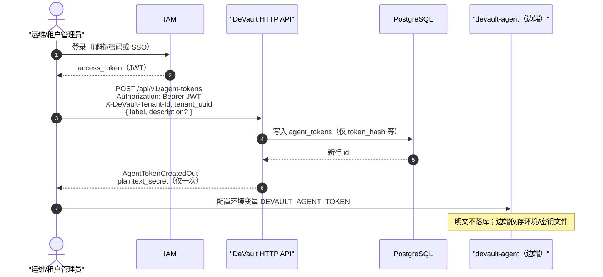
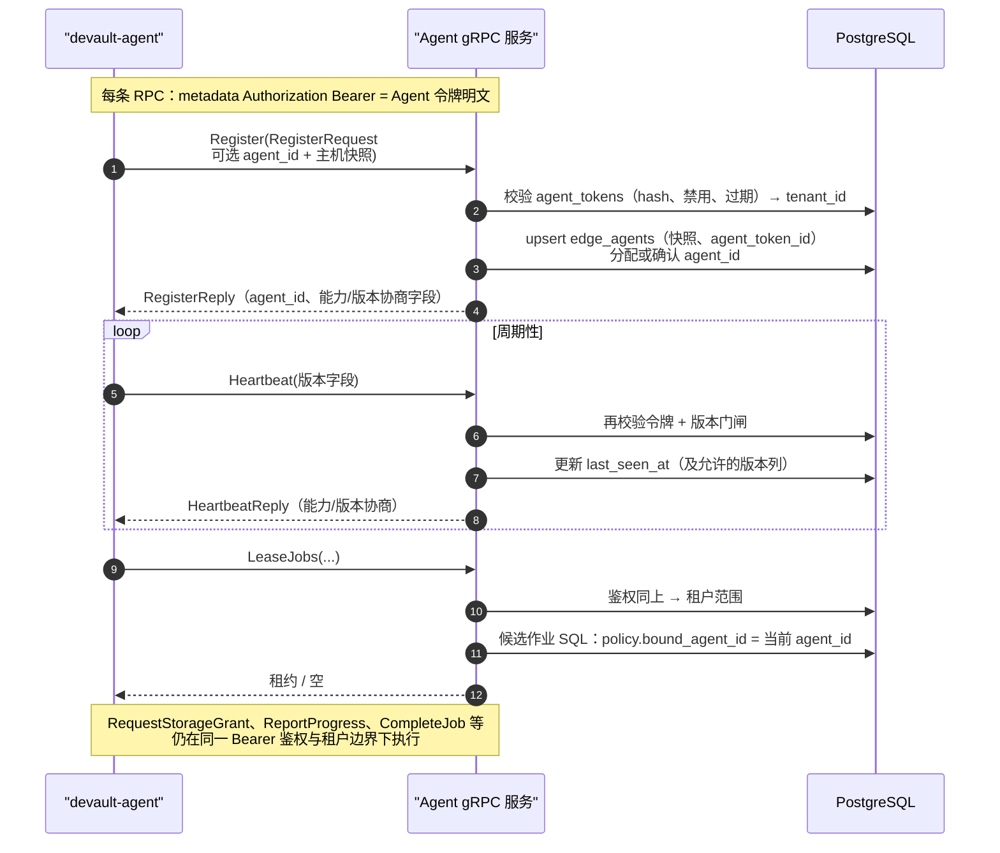

# gRPC（Agent）

## 接口定义

**`proto/agent.proto`**

修改后：

```bash
bash scripts/gen_proto.sh
```

## 能力与入口

Agent 通过 gRPC **Register / Heartbeat / LeaseJobs / RequestStorageGrant / ReportProgress / CompleteJob** 等完成作业；详见 proto。

[gRPC](../trust/agent-connectivity.md)、[端口速查](./ports-and-paths.md)。

## Register 与 Agent 令牌

租户管理员在控制台或 **`POST /api/v1/agent-tokens`** 创建 **长期 Bearer**（明文仅创建时返回一次）。边端 **`devault-agent`** 配置 **`DEVAULT_AGENT_TOKEN`**，所有 Agent gRPC 请求在 **`Authorization: Bearer`** 中携带该令牌。

**Register** 在鉴权通过后写入 **`edge_agents`** 主机快照（**`hostname` / `os` / `region` / `env` / `backup_path_allowlist`**）并返回 **`agent_id`**（首次分配或复用本地持久化的实例 id）。**Heartbeat** 仅刷新 **`last_seen_at`** 并校验 **`agent_release` / `proto_package`**，不更新主机快照列。

吊销：禁用对应 **`agent_tokens`** 行（**`POST /api/v1/agent-tokens/{id}/disable`**）。**`LeaseJobs`** 仅返回 **`policies.bound_agent_id`** 与当前 **`agent_id`** 一致的待办作业（每条策略必须绑定一台已注册 Agent）。

## 时序概览

以下示意与当前实现一致：**长期 Agent 令牌**经 HTTP 签发；**全部 Agent gRPC** 使用同一 **`Authorization: Bearer`**；**无** enrollment、**无** Register 换发的 Redis 会话。

### 1. 签发令牌并配置边端（HTTP）



演示栈可由 **`demo-stack-init`** 代为调用同一 HTTP 路径并将明文写入共享卷，见 [Docker Compose](../admin/docker-compose.md)。

### 2. 注册、存活与领作业（gRPC）



更完整的舰队与策略语义见 [Agent 舰队](../admin/agent-fleet.md)。

## 版本协商

Agent 携带 **`agent_release`**、**`proto_package`**、**`git_commit`**；控制面返回 **`server_release`**、**`min_supported_agent_version`** 等。

| `devault-reason-code` | 典型 gRPC 状态 |
|-----------------------|----------------|
| `AGENT_VERSION_TOO_OLD` | `FAILED_PRECONDITION` |
| `AGENT_PROTO_PACKAGE_MISMATCH` | `FAILED_PRECONDITION` |
| `AGENT_VERSION_REQUIRED` | `FAILED_PRECONDITION` |
| `AGENT_REGISTRY_MISSING` | `FAILED_PRECONDITION`（LeaseJobs） |

详见 [租户与访问控制](../admin/tenants-and-rbac.md)（gRPC auditor 禁止）、[Agent 舰队](../admin/agent-fleet.md)。

### server_capabilities

**`HeartbeatReply`** / **`RegisterReply`** 带 **`server_capabilities`**（如 **`s3_presign_bundle`**、**`multipart_resume`**）；权威列表见仓库 **`docs/compatibility.json`** 与 [兼容性与版本矩阵](../engineering/compatibility.md)。

### CompleteJob 与恢复演练

**`CompleteJobRequest.agent_hostname`**：可选；控制面写入 **`jobs.completed_agent_hostname`**（审计）；未传时回退 **`edge_agents.hostname`**。

**`kind=restore_drill`** 时可填 **`result_summary_json`** → **`jobs.result_meta`**（见 [恢复演练](../user/restore-drill.md)）。**`kind=path_precheck`** 时同样通过 **`result_summary_json`** 上报 **`devault-path-precheck-report-v1`**（见 [Agent 舰队](../admin/agent-fleet.md) §路径预检）。

相关环境变量见 [配置参考](../admin/configuration.md) 中 gRPC 小节。
