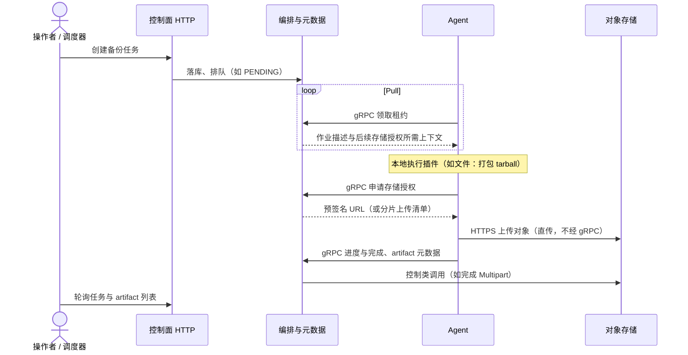
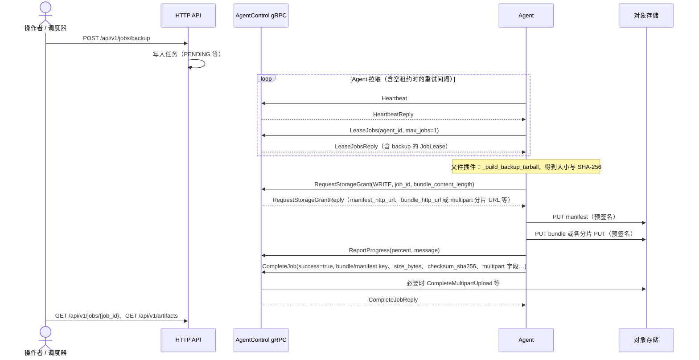
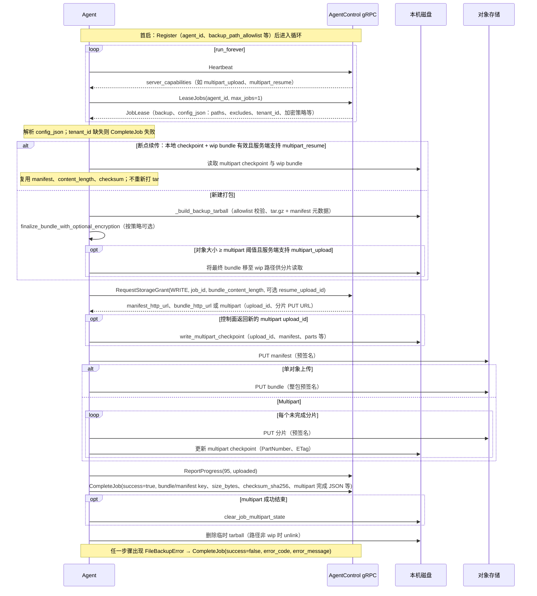
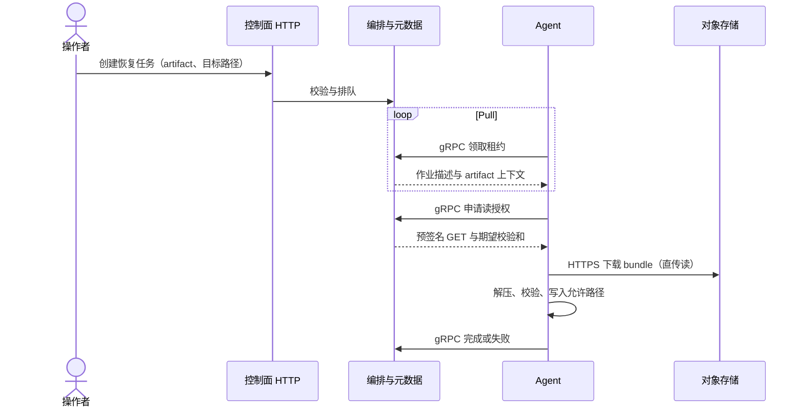
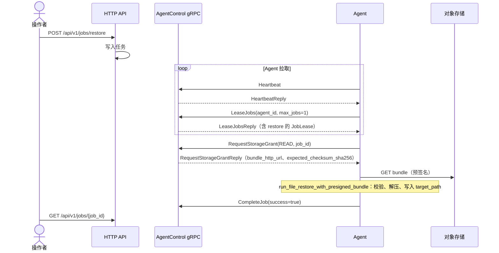

# 备份与恢复流程

本章说明 **备份/恢复在控制面与数据面如何协作**（含时序图），并给出 **HTTP API** 与可选 **CLI** 的操作步骤。体系结构总览见 [架构一页纸](../product/architecture.md)。

若你要备份的是 **控制面自身的 PostgreSQL 元数据库**，请参阅 [控制面元数据库备份与 DR](../admin/control-plane-database-dr.md)，勿与下文「Agent → S3 artifact」混淆。

周期性 **恢复演练** 见 [恢复演练](./restore-drill.md)。

## 设计要点（控制面 vs 数据面）

- **控制面**：经 **HTTP** 创建/查询任务与 artifact；经 **`AgentControl` gRPC**（`proto/agent.proto`）发放租约、存储授权、接收进度与完成回调；在 `s3` 后端下 **签发预签名** 并记录对象 key、artifact 元数据。
- **数据面**：Agent 使用预授权，经 **HTTPS** 与 **S3 兼容存储** 直传读写；**大对象不经过 gRPC**。
- **Pull**：Agent **主动**调用 `LeaseJobs` 领取作业。

首启且未配置 `DEVAULT_API_TOKEN` 时，Agent 可先调用 **`Register`** 用一次性密钥换取 Bearer（见 `agent.proto` 注释）；循环中发送 **`Heartbeat`**。大对象分片、恢复侧流式与重试见 [大对象与恢复](../storage/large-objects.md)、[存储调优](../storage/tuning.md)。**Artifact 加密**见 [Artifact 静态加密](../trust/artifact-encryption.md)。租户级存储（BYOB、AssumeRole）见 [租户与访问控制](../admin/tenants-and-rbac.md)、[对象存储模型](../storage/object-store-model.md)。

---

## 备份

### 跨角色总览



### 租约、存储授权与上传收尾

与当前 **文件备份** 实现一致：`LeaseJobs` 返回 `JobLease` 后，Agent 在本地生成 tarball 与 manifest，再调用 **`RequestStorageGrant`**（`STORAGE_INTENT_WRITE`，携带 `bundle_content_length`）；应答中为 manifest / bundle 提供预签名 URL，或在大对象场景下提供 **multipart** 分片 PUT；上传后 **`ReportProgress`**，最后 **`CompleteJob`** 携带校验和与 multipart 完成信息，控制面登记 **artifact** 并完成 S3 侧 **CompleteMultipartUpload** 等操作。



失败时 Agent 会 **`CompleteJob(success=false, error_code, error_message)`**。

### Agent 端文件备份（实现级时序）

下列时序对应 **`src/devault/agent/main.py`** 中 `_run_one_job` 在 **`JobKind.BACKUP`** 下的分支，以及 **`src/devault/plugins/file/plugin.py`** 中的打包、可选加密与 **`upload_backup_via_storage_grant`** 上传逻辑。控制面在图中抽象为 **AgentControl gRPC**（签发租约、存储授权、登记 artifact；大对象完成类调用见上文）。



要点简述：

- **租约配置**：`config_json` 须含 **`tenant_id`**，并与控制面约定的 **`artifact_object_keys`**（`bundle.tar.gz` / `manifest.json` 前缀）一致。
- **断点续传**：仅当本地 checkpoint 与 wip 文件通过校验且 **`multipart_resume`** 在能力集中启用；否则会先清理本地 multipart 状态再全量重打包。
- **上传顺序**：始终 **先 manifest、后 bundle**（与 `upload_backup_via_storage_grant` 一致）；multipart 时控制面在 **`CompleteJob`** 后完成 **CompleteMultipartUpload** 等收尾（见上文「租约、存储授权与上传收尾」）。

---

## 恢复

### 跨角色总览



目标路径必须在 Agent 的 **`DEVAULT_ALLOWED_PATH_PREFIXES`** 内；覆盖非空目录需在 API 中显式确认。

### 租约、存储授权与本地还原

领到 **`JobLease`（restore）** 后调用 **`RequestStorageGrant`**（`STORAGE_INTENT_READ`），应答必须带 **`expected_checksum_sha256`**（或配置中提供）；Agent 使用 **`bundle_http_url`** 拉取对象，校验后解压到目标路径，最后 **`CompleteJob(success=true)`**。



---

## 备份（API 步骤）

1. **`POST /api/v1/jobs/backup`**，请求体包含插件类型与配置（文件插件示例见 [快速开始](./quickstart.md)）。
2. 记录 **`job_id`**。
3. 轮询 **`GET /api/v1/jobs/{job_id}`** 至终态。
4. **`GET /api/v1/artifacts`** 列出可恢复产物。

## 恢复（API 步骤）

1. 在 Agent 可达路径下准备目标目录。
2. **`POST /api/v1/jobs/restore`**，提供 `artifact_id` 与 `target_path`。
3. 目标非空时需 `confirm_overwrite_non_empty: true`（CLI 对应 `--force`）。
4. 轮询任务至成功。

## CLI（可选）

```bash
pip install -e .
devault file backup /data/sample
devault job wait <job_id>
devault artifact list
devault file restore <artifact_id> --to /restore/out2 --force
```

根目录 **`README.md`**（英文，默认）与 **`README.zh-CN.md`**（中文）为仓库速览；CLI 与本地运行细节以本站 **安装 / 运维** 章节为准。
